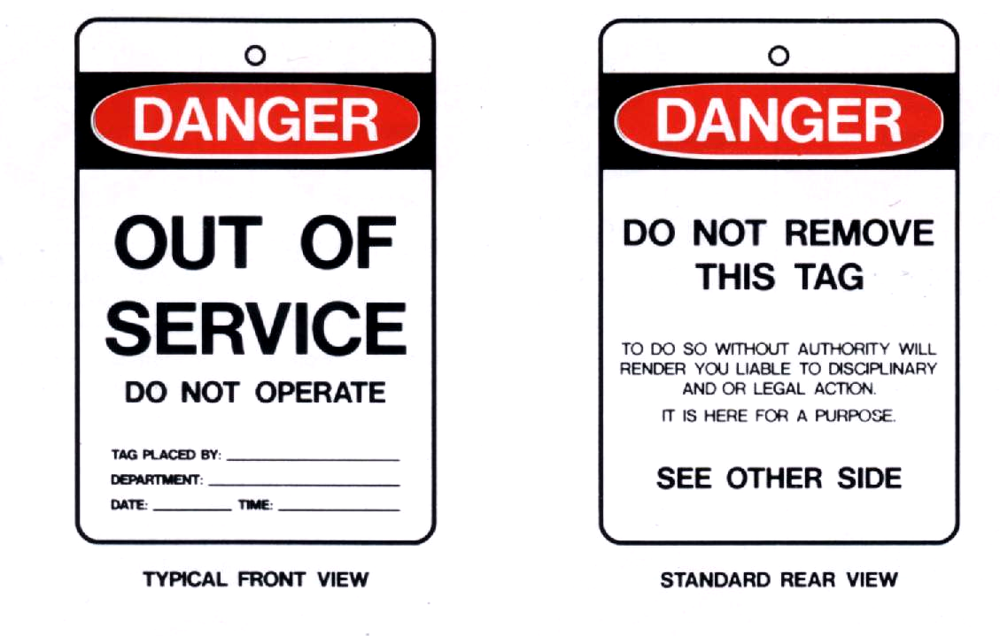

**MODULE 2.**

**WORK HEALTH AND SAFETY.**

**Aim:**

To have all crew aware of their obligations to make the James Craig a
safe place to be.

**Overview:**

The new Work Health and Safety (WHS) laws became effective from
1\ :sup:`st` January 2012.

The Sydney Heritage Fleet, although a not for profit volunteer based
organisation, because it has paid employees is now classed as “person
conducting a business or undertaking” (PCBU). As such ‘employees’ and
‘volunteers’ are ‘workers’ under the act.

Your Obligations (Extract from Work Cover New South Wales fact sheet –
Volunteers).

“As a PCBU, you must ensure the health and safety of workers – including
volunteers who you engage – consult with them on WHS matters, and
provide them with the necessary information, training and supervision.

If you are an officer who is a volunteer, you must comply with health
and safety duties, but you cannot be prosecuted for an offence as an
officer. You may be held liable, however, if you do not comply with your
duties as a ‘worker’ or ‘other’.

As a volunteer, you must take reasonable care for your own – and other
people’ – health and safety. If you are engaged by a PCBU, you are a
worker and must comply with any reasonable instructions, policies and
procedures relevant to health and safety given by the PCBU.”

All Sydney Heritage Fleet personnel must attend adequate site-specific
induction and site-specific work activity safety training.

This Module has three parts;

1. Study the following safety rules & safety tips.

2. Watch the James Craig OH & S DVD or complete the online unit and
   submit.

3. Complete the James Craig written safety induction quiz.

**Assessment:**

Satisfactorily complete James Craig safety quiz, UNIT 2 in the online
training. Completion will be recorded in crew members ‘Diary of Service
and Experience Log’ book.

**Outcome:**

Crew to be fully aware of their responsibilities to themselves, the
passengers and to other members of the crew.

**SAFETY RULES**

    | 1. **Report any hazard that is beyond your control;**
    | such as repairs that are required; other people putting us at
      risk; change to the original job that has introduced new
      unexpected danger; weather or other work conditions such as poor
      lighting that cause risk\ **. Note: Put a "Danger " tag on unsafe
      equipment. The tag is only removed by the person who put the tag
      on, when the fault is rectified**

    |image0|

    2. **Use the correct equipment for the job you are doing;
    **\ get the right size, type, rating, model, etc.

    3. **Keep your work area and equipment clean, tidy and in good
    repair;
    **\ a place for everything and everything in its place; all
    unnecessary items removed; and frequently review all items in the
    work area\ **. It may be necessary to quarantine/isolate the work
    area.**

    4. **Use the correct safety equipment and protective clothing for
    the job you are doing;
    **\ depending on the job make sure that the proper protection is
    used (e.g. welding screens, breathing protection, eye protection,
    hearing protection, foot protection, tags, flashing lights, guards,
    electrical earth leakage devices, up-to-date inspection tags, fire
    equipment, etc).

    | 5. **Obey rules, signs and instructions and only work with
      equipment you have been assessed as competent to use;**
    | obey signposts and warning notices; obtain work permits for jobs
      with special risks; comply with special rules developed for
      specific work areas; follow standard operating procedures; read
      the instructions before use and use the work method statements
      provided for the task, remember - "one hand for you and one hand
      for the ship\ **". Locate the stop button before starting
      equipment.**

    6. **Use safe lifting tactics to move heavy loads, and get help or
    mechanical assistance for heavy loads;
    **\ use fork lift trucks, cranes and hoists rather than manual
    handling; use trolleys, wheels, levers, skids, handy billy, capstan,
    windlass and conveyors, to move loads; remember to bend your knees
    when lifting and plan any manual handling to avoid injuries.

    7. **Know your emergency procedures;
    **\ get first aid trained; find out what to do in the event of a
    substance leak, fire or other possible emergency, explosion; learn
    where the first aid kit is; learn where the evacuation control point
    is; know how to raise the emergency alarm and how to telephone for
    help; know how to treat injuries and how to avoid blood
    contamination.

    8. **Ask if you are in doubt about any safety procedure;
    **\ you should never be embarrassed to report any safety concerns.
    Sydney Heritage Fleet supervisors have the legal responsibility to
    ensure health and safety and **YOU** must do everything you can to
    help them fulfil their obligations. Sydney Heritage Fleet
    supervisors have to provide training, information, instruction and
    supervision so that work is done safely.

    | 9. **Get first aid for all injuries you suffer;**
    | it is a legal requirement for the Sydney Heritage Fleet to keep a
      register of all injuries that happen at work. The Government
      inspector from the Work Cover Authority can ask to see the
      records. If we do not report and treat all injuries we can be
      prosecuted by the Government. More importantly, quick first aid
      can stop minor injuries becoming more serious.

    10\ **.** **Report all mishaps;
    **\ It is a legal duty for the Sydney Heritage Fleet to report to
    the Work Cover Authority all accidents involving serious injuries as
    well as all dangerous occurrences. We must make sure that all
    accidents are reported and analysed in order to prevent future
    mishaps.

    | 11. **Help maintain site security;**
    | Challenge any unfamiliar people on site to find out whether they
      are authorised to be on site; remind visitors of the visitor
      safety rules; inform the Site Duty Officer of anything untoward.

    12. **Work Statements and Risk Analysis;**

    Work Statements and Risk Analysis will be completed for ALL major
    tasks. These combined with pre start briefing are to be read and
    signed by ALL participating crew.

**SOME SAFETY TIPS**

We all want a healthy life, free from danger for ourselves and our crew
mates. However, many of the simplest things we do from crossing the road
to having a shower are fraught with danger.

As we live with these hazards every day, we have learned techniques to
see the chance of an accident. For example, we look both ways before
crossing the road, don't leave the soap on the floor of the shower,
check yard braces before climbing, just to mention three.

Attitude.
=========

    Safety is an attitude of mind. We all love a joke but must never
    skylark or play practical jokes on the job.

Work environment.
=================

    Ensure that your work area is properly lit and ventilated and is
    kept as clean and pleasant as is possible.

    Unpleasant working conditions can cause fatigue, which can lead to
    lack of concentration. Work with a mate or at least make sure
    someone knows where you are.

Be alert to your surroundings.
==============================

    Be on the lookout for hazards, look after yourself and your
    crewmates and concentrate on what you are doing. If you see a
    hazard, fix it and report it.

Do not distract others.
=======================

    From simple courtesy, if you approach someone who is concentrating
    on a task, take care to wait until they acknowledge you before
    talking to them. If you distract them it could cause them to make a
    mistake or, worse, cause an accident.

Clothing and personal items.
============================

    When carrying out maintenance etc, a correct sized boiler suit with
    sleeves buttoned and a sturdy pair of safety boots, are ideal. Loose
    flapping clothing can be caught in machinery, blocks or equipment.
    People who wear their hair long must tie it back or cover it.

When sailing, appropriate uniform etc should be worn.

    When handling metal or in a hazardous environment, wear gloves to
    keep your hands clean and free from cuts.

    Appropriate sailing groves may be worn for handling lines etc.

    Watches, rings and other jewellery can be caught on machinery and
    cause injury.

Safety equipment.
=================

    Wear the correct protective equipment for your environment and obey
    all safety signs such as hardhat areas, eye and hearing protection
    etc.

Walkways. (Deck and companion ways)
===================================

    In some areas there are lines marked on the floor or deck. These
    outline safe walkways, so when walking through the area keep within
    the lines. Do not place any item on, or protruding into, the walkway
    as it may be snagged by a vehicle or person and cause an accident.

On board companion ways and stairs can be particularly hazardous,
especially at sea. Always descend companion ways and ladders by facing
the companion way or ladder

and maintaining a firm hand hold.

8. .. rubric:: 
      :name: section

   .. rubric:: Unsteady or slippery surfaces.
      :name: unsteady-or-slippery-surfaces.

Try not to walk or climb on surfaces that may move or are slippery such
as piles of rope, painted surfaces, cargo, round metal bars, pipes etc.

    Clean up any spills as soon as you can or at least throw down
    something to soak up the spill. Handrails are there to maintain your
    balance, not to support your weight. Remember the old saying - "One
    hand for you and one hand for the ship"

10. .. rubric:: 
       :name: section-1

    .. rubric:: Power Tools.
       :name: power-tools.

..

    Ensure your power tools and extension cords are in good condition
    and have the proper inspection tags.

    Unless you are properly qualified, do not attempt to examine, adjust
    or repair power tools.

Eye protection.
===============

    Protect your eyes at all times and wear safety glasses where there
    are flying particles or sparks. Never look at welding with
    unprotected eyes as this can cause serious and permanent damage, so
    turn your head away or shield your eyes with a hand. Ideally,
    welding should be done behind screens, but this is not always
    possible.

Hearing protection.
===================

    In a noisy environment wear hearing protection. Noise can damage
    hearing and can also cause fatigue and loss of concentration.

    **Hand tools**.

    Your tools should be the correct size and type for the job and in
    good condition. The wrong tool can slip and cause injury and a
    chisel with a burred over end can cut your hand.

Cranes, Windlass, Capstan and lifting gear.
===========================================

    Only authorised people may use cranes etc. Slings and other items
    used for lifting must be in good order and suitable for the task. Do
    not walk or stand under a suspended load.

Machinery.
==========

    Persons operating machinery should ensure that guards are in
    position; the machine is safe and so does not harm them or others.
    Before STARTING any machine make sure you know how to STOP IT.

Working at heights.
===================

Learn how to place ladders and other equipment and wear the proper
safety harness

    and gear appropriate to the height you are working. All tools and
    equipment taken aloft are to be secured to you with a lanyard.

**Confined spaces.**

Crew are not to enter a closed or confined space until it is declared
safe, i.e. ventilated, access is clear, air circulation has been
established, are tested, appropriate protection

equipment is to be worn, recovery gear is at hand.

Painting.
=========

    All thinners and paint must be sealed and stored in the paint store
    when not in use.

Chemicals.
==========

    A number of chemicals such as strippers, paint and boiler feed water
    additives etc., are used. If they are hazardous treat them with care
    and keep them sealed and stored properly.

**Waste.**

Make sure ALL waste (Old rags, Paints, chemicals etc) has been removed
to a safe

storage/disposal after a task has been completed.

    **Finally, do not be afraid to ask.**

    Nobody can know it all: Most people are flattered if you ask their
    advice, so you will make a new friend as well as increasing your
    knowledge. Our Fleet has many highly skilled volunteers who are only
    too happy to pass on their expertise.

**Remember - "If you can't do it safely, don't do it!**

