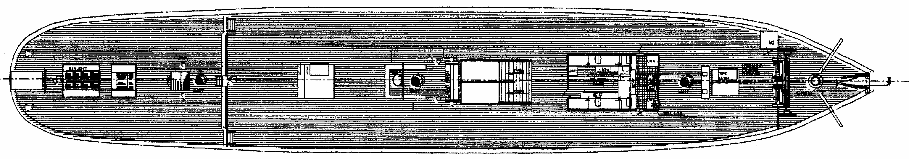
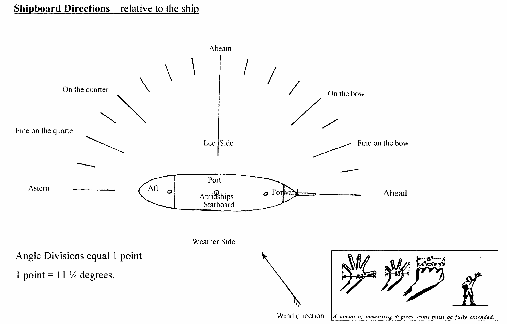
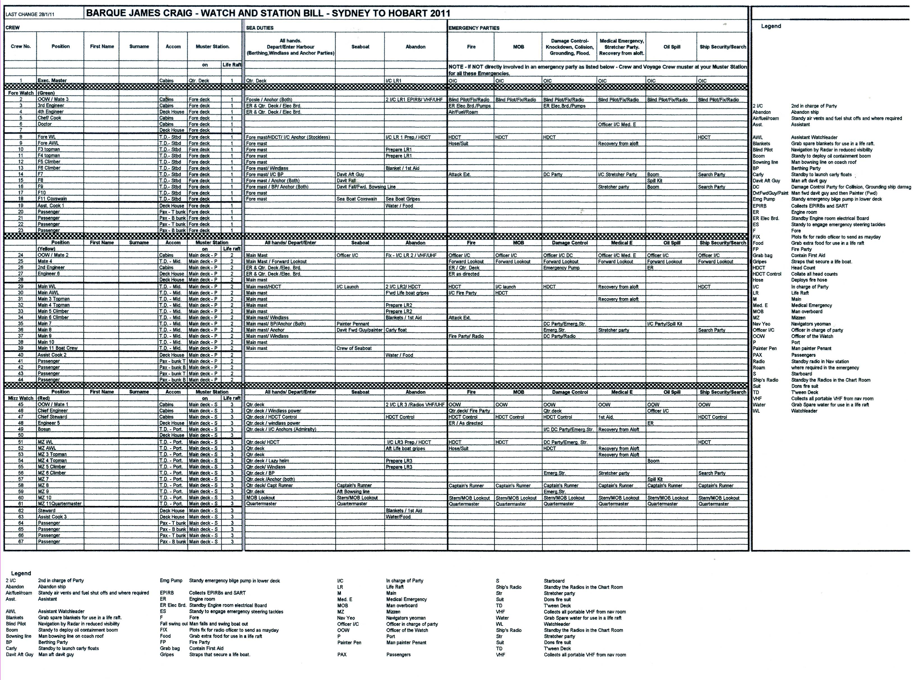

**MODULE 3.**

***************************
Ship Inspection & Operation
***************************

**Aim:**

Tour the ship and inspect all areas.

Acquaint crew member with location of all emergency equipment as
displayed on the ship’s emergency plan.

**Overview:**

Inspect all decks and compartments in the ship.

Explain - Safety equipment including rafts and life jackets

- Alarm systems

- Marking time with the Ship’s bell

- General crew information for day sails

- James Craig crew structure for day sails

- Ship’s plan

- Direction, relative to the ship.

- General crew organisation information for voyaging.

**Assessment:**

Oral examination by a Watchleader, who will, when satisfied, sign off
the relevant part in the crew member’s ‘Diary of Service and Experience
Log’ book.

**Outcome:**

Crew to become familiar with layout of the ship and equipment carried.

**SAFETY EQUIPMENT**

The ship’s safety plan is displayed in two locations, at the engine room
door and amidships on the port side of the ‘tween deck. The schematic
diagrams show the location of emergency equipment, and escape routes,
get to know them.

The James Craig carries a full range of safety and emergency equipment
that includes;

-  Life jackets.

-  Fire extinguishers, fire hoses and galley fire blankets.

-  Fire pumps, bilge pumps and auxiliary fire/bilge pump.

-  Life rings, carley float and three self inflating life rafts.

-  Engine room fire smothering system.

-  Escape hatches.

-  Flares, EPIRBs, line throwers.

-  MOB Dan Buoy and markers.

-  Radios.

-  Rescue from aloft gear and stretchers

-  Safety harnesses.

-  Axes, crowbars etc.

-  Emergency steering gear.

   #. .. rubric:: **ALARMS**
         :name: alarms

In addition to raising an alarm by voice the James Craig has three alarm
systems;-

**1. Manual Alarm**

The Manual Alarm is activated by the breaking of the glass panel and
pressing the button at the Fire Alarm Panel .

Call out.

**2. Automatic Alarm**

The **Automatic Alarm is activated whenever one of the vessel's smoke**
or **thermal** detectors is triggered. The Alarm sets off the sirens
located throughout the vessel and a light is displayed on the Alarm
Panel indicating the location of the triggered sensor(s). The Alarm is
continuous until cancelled at the Alarm Panel.

**3. General Alarm**

The General Alarm is manually activated by the Deck Officer Of the Watch
(OOW) from the Quarter Deck. The Alarm is the ringing of the alarm bells
located throughout the vessel and the sounding of the ship's whistle as
follows:

General Emergency: Seven (7) short blasts (4 seconds each) on the ships
whistle followed by one (1) long blast (at least 10 seconds) and
repeated on the ship's alarm bells.

    Man Overboard: Three long (at least 10 seconds each) blasts on the
    ship's whistle and alarm bells.

    Stand Down: (Following a prior alarm signal) Continuous ringing of
    the ship's

    alarm bells for 15 seconds.

    Prepare to Abandon Ship: One short blast followed by one long blast
    on the ship's whistle and alarm bells, repeated three times.

    Abandon Ship: The signal to Abandon Ship will be given verbally by
    the Master and repeated throughout the accessible compartments of
    the ship by crew specifically directed by the Master to do so. In
    addition, if time and circumstances permit the signal will be the
    continuous sounding of the whistle/or alarm bells for at least 30
    seconds.

NOTE: In sounding any Alarm involving the use of the ship's whistle, the
Deck OOW

must first ensure that any crew working aloft in the vicinity of the
whistle are

forewarned.

4. Exercises
============

As an ongoing practice to maintain professional performance by our crew,
frequent exercises for Fire, General Alarm, Abandon Ship, and Man
Overboard alarms are conducted using the ship’s bell, whistle & P.A.
system. All such alarm signals will be preceded by the statement “ For
exercise – for exercise – for exercise” on the P.A. System.

#. .. rubric:: 
      :name: section

   .. rubric:: 
      :name: section-1

   .. rubric:: MARKING TIME WITH THE SHIP’S BELLS
      :name: marking-time-with-the-ships-bells

   .. rubric:: This extract may be of interest to all regarding time
      keeping on board. Extracted from "Admiralty Manual of Seamanship"
      Vol.1.1964. Be aware that local or recent changes may supersede
      some of this. Particularly regarding alarm signals.
      :name: this-extract-may-be-of-interest-to-all-regarding-time-keeping-on-board.-extracted-from-admiralty-manual-of-seamanship-vol.1.1964.-be-aware-that-local-or-recent-changes-may-supersede-some-of-this.-particularly-regarding-alarm-signals.

**Time and Watches.**

The seaman uses the 24-hour clock and his day is divided into seven
periods called watches. The day starts at midnight and the time is
recorded in four figures, of which the first two denote the hour and the
last two the minutes.

The following table shows the difference in the recording of time by
civil and naval methods.

Name of Watch Duration in Duration in

Civil time Naval time

Middle Midnight to 4 a.m. 0000 to 0400

Morning 4 a.m. to 8 a.m. 0400 to 0800

Forenoon 8 a.m. to 12 p.m. 0800 to 1200

Afternoon 12 p.m. to 4 p.m. 1200 to 1600

First Dog 4 p.m. to 6 p.m. 1600 to 1800

Last Dog 6 p.m. to 8 p.m. 1800 to 2000

First 8 p.m. to Midnight 2000 to 2400

The purpose of dividing the period between 1600 and 2000 into the two
Dog Watches is to provide an odd number of watches in the 24-hour day so
that the port and starboard watches will keep a different watch each
day.

The seaman, unlike the civilian, does not speak of the morning,
afternoon and evening, but of the morning, forenoon, afternoon, dog
watches, first and middle watches.

**Striking the ship's bell.**

The time is indicated by striking the hours and half-hours on the ship's
bell throughout each watch, except in silent hours and during church
services, in accordance with the table below; the time thus indicated is
called "one bell, two bells, etc. according to the number of times the
bell has been struck;

first half-hour 1 bell second hour and a half 5 bells

first hour 2 bells third hour 6 bells

first hour and a half 3 bells third hour and a half 7 bells

second hour 4 bells fourth hour 8 bells

This sequence is repeated in each watch, with the exception of the last
dog watch: seven bells, for example, can therefore indicate
0330,0730,1130,1530 or 2330, and so, when quoting the time by this
method, the name of the watch is added; 1130 for example, is described
as "seven bells in the forenoon". Time in the last dog watch is marked
as follows:1830 by one bell,1900 by two bells,1930 by three bells and
2000 by eight bells.

Except for marking the time the ship's bell is struck only when the ship
is at anchor in a fog or bad visibility, or in some ships, to sound the
general alarm in the event of fire or other emergency. The fog signal is
the rapid ringing of the bell for about five seconds every minute. For a
general alarm the bell is rung rapidly for considerably longer than five
seconds, and this is usually followed by a bugle call or a "pipe"
indicating the nature of the emergency and giving orders for dealing
with it. The general alarm is only sounded by order of the Commanding
Officer.

Silent hours.

This term denotes the period of the night watches, between the time of
"pipe down" and calling the hands, when it is customary not to mark the
time by the ship's bell in order to avoid unnecessarily disturbing the
watch below and the day-men. During the silent hours at sea the watch
next on deck is sometimes called by the words "all the (named) watch",
the call being made much less loudly than in daytime. At five or ten
minutes to the hour for relieving the watches the bell may be struck
once, softly, as a signal for the relieving watch to muster, this strike
being called "little-one-bell"."

**GENERAL INFORMATION FOR DAY SAILS**

The following notes are for the guidance of crew joining the ship for
day sails.

Tips for voyages are in Module 20.

If at any stage you are not sure what to do, do not do it, ask first.

**Personal Equipment**.

Personal items should be stored on board, below in a suitable secure
bag.

    Beware of sunburn & windburn. Sunscreen is available on board, but
    those with special requirements should bring their own protection.

**Drugs and Sea Sickness Pills**.

    Personal medications and sea sickness remedies may be brought on
    board. However if these are likely to effect your performance,
    especially in duties requiring climbing, inform your Watch Leader.
    Remember if you feel sick during a voyage it is generally too late
    to take medication, and for it to be immediately effective.

**Food & Drink.**

**No** alcohol is to be brought on board or consumed by crew in the
ship.

    Basic lunch, Tea and Coffee are provided for crew on sailing days.
    Those crew with special needs, i.e. large appetites, special diets
    etc, should bring appropriate extras with them.

Beware of dehydration – drink plenty of water throughout a day.

**Uniform**. (Refer to Sydney Heritage Fleet – James Craig – Uniform
Policy for detail)

Basic crew uniform is made up as follows;

    . Navy blue “King Gee” style work pants. Available from Lowes etc.
    Yes these do come in a cut for the ladies. Approx. $40.00

. Crew shirt, with Logo, available from Sydney Heritage Fleet. Refer to
the Office.

. Jumper, Navy Blue. Long sleeve field jumpers that are available from
surplus stores. Cost around $70.

    . Sailing gloves. Your choice to use. However there are inheritant
    dangers/risks in their use. Refer Module 5, Safe line handling.

    . Shoes. Your choice, however would suggest with heel. Many crew use
    elastic sided work boots such as those produced by “Oliver” Approx
    cost $60.00. Crew involved in the engine room will have to wear
    safety toe caps.

    Bare feet ARE NOT an option.

. Headgear. Fleets merchandise carries appropriate Hats, Caps and
Beanies.

. Foul weather gear. Your choice at this time. Warm and dry style
recommended.

. Sheath knife and spike. Group purchase of this item runs at around
$65.00.

    . In keeping with the ship’s age, the wearing of period costume
    (1874 seamen) is encouraged on day sails.

**Safety.**

. The ship carries an adequate number of Life Jackets for all Crew and
Passengers.

. Climbing harnesses are provided for all crew involved in climbing
aloft. Harnesses should be looked after and not exposed to unnecessary
risk of damage.

. First Aid equipment is carried.

    . If you observe any situation that could endanger yourself or
    others, bring it to

    the attention of your Watchleader or the Officer Of the Watch.

. Secure loose items to your person with a lanyard. Especially if taken
aloft. Preferably leave them on deck.

. Due to potential danger when handling lines, it is advisable to remove
rings and jewellery.

    . Long hair and beards pose a hazard when working with lines and
    near blocks. Retain with a net or suitable hat etc.

**Punctuality.**

    If you are listed as crew for a sail, be on board and sign in by
    turn to time. For a last minute cancellation phone the ship on 0425
    240032.

**GENERAL DUTIES FOR DAY SAILS.**

Deck crew are divided into two Watches known as the Fore Watch who look
after the forward section of the ship under instructions from the Fore
Watch Leader, and the Main Watch who look after the aft section of the
ship under instructions from the Main Watch Leader. On some occasions
both watches work together to work the ship.

A Watch and Station Bill is prepared for every day sail. This sets out
all the positions and duties for all crew members.

Individual duties from the Watch and Station Bill are shown on each crew
member’s Crew Card. Duties, special duties, emergency station and muster
station instructions are listed on your crew cards. These cards are
handed out by the Watchleaders, after the Mate’s muster.

**An example of a typical crew card:**

Crew member number 16 in the main watch.

**FRONT OF THE CARD** Back of card

+-----------+-----------+-----------+-----------+-----------+-----------+
| **Crew    | **Positio |           |           | **Muster  |
| No.**     | n**       |           |           | Station** |
+-----------+-----------+-----------+-----------+-----------+-----------+
| ** **     | ** **     | ** **     | ** **     | **On      | **Life    |
|           |           |           |           | deck**    | Raft**    |
+-----------+-----------+-----------+-----------+-----------+-----------+
| **M16**   | **Main    | ** **     |           | **Fore    | **1**     |
|           | Deck**    |           |           | mast**    |           |
+-----------+-----------+-----------+-----------+-----------+-----------+
| **Special |           |           | **Watch   | **Hour of |
| Sea       |           |           | duties;** | duty;**   |
| Duties;** |           |           |           |           |
+-----------+-----------+-----------+-----------+-----------+-----------+
| **Depart/ | Main mast |           |           |           |           |
| Enter     |           |           |           |           |           |
| Harbour** |           |           |           |           |           |
+-----------+-----------+-----------+-----------+-----------+-----------+
| **Sea     |           |           | ** **     | ** **     |           |
| Boat**    |           |           |           |           |           |
+-----------+-----------+-----------+-----------+-----------+-----------+
| ** **     |           |           | ** **     | ** **     |           |
+-----------+-----------+-----------+-----------+-----------+-----------+
| **Emergen | Main mast |           | **Forward |           |           |
| cy        |           |           | Lookout** |           |           |
| Station** |           |           |           |           |           |
+-----------+-----------+-----------+-----------+-----------+-----------+
| ** **     |           |           | ** **     | ** **     |           |
+-----------+-----------+-----------+-----------+-----------+-----------+
| ** **     |           |           | **Stern   | **3**     |           |
|           |           |           | Lookout** |           |           |
+-----------+-----------+-----------+-----------+-----------+-----------+
| **Emergen |           |           |           |           |           |
| cy        |           |           |           |           |           |
| Duties;** |           |           |           |           |           |
+-----------+-----------+-----------+-----------+-----------+-----------+
| **Abandon | Release   | **Helm**  |           |           |
| ship**    | Gig       |           |           |           |
|           | gripes    |           |           |           |
+-----------+-----------+-----------+-----------+-----------+-----------+
| **Fire**  | Party -   | ** **     | ** **     |           |
|           | Radio/    |           |           |           |
|           | Assist    |           |           |           |
+-----------+-----------+-----------+-----------+-----------+-----------+
| **MOB**   |           |           | **Captain | **8**     |           |
|           |           |           | 's        |           |           |
|           |           |           | Runner**  |           |           |
+-----------+-----------+-----------+-----------+-----------+-----------+
| **Damage  | Party -   |           | ** **     | ** **     |           |
| Control** | Radio     |           |           |           |           |
+-----------+-----------+-----------+-----------+-----------+-----------+
| **Medical |           |           | **Patrol* | **2 & 5** |           |
| /First    |           |           | *         |           |           |
| Aid/Str.* |           |           |           |           |           |
| *         |           |           |           |           |           |
+-----------+-----------+-----------+-----------+-----------+-----------+
| **Stretch |           |           |           |           |           |
| er**      |           |           |           |           |           |
+-----------+-----------+-----------+-----------+-----------+-----------+
| **Spill** | Party -   |           | ** **     | ** **     |           |
|           | Radio     |           |           |           |           |
+-----------+-----------+-----------+-----------+-----------+-----------+
| **Ship    | Assist    |           | **Climb** | **NO**    |           |
| Security/ |           |           |           |           |           |
| Search**  |           |           |           |           |           |
+-----------+-----------+-----------+-----------+-----------+-----------+

A list of Special Sea Duties, Emergency Station and Emergency Duties are
shown on the **front** of your Crew Cards;

- Depart/Enter Harbour

- Sea Boat (Coxswain and crew plus launch/recovery party)

- Abandon ship

-  Fire Party (Leader plus crew)

-  Man Overboard (MOB)

-  Damage Control

-  Medical/First Aid/Stir. (Stretcher party)

-  Spill

-  Ship Security/Search

-  Passenger climbing

In the column, alongside each item, information will tell if you have a
roll and what it is. If it is blank, you are not involved.

**Front of card BACK OF THE CARD**

+-----------+-----------+-----------+-----------+-----------+-----------+
| **Crew    | **Positio |           |           | **Muster  |
| No.**     | n**       |           |           | Station** |
+-----------+-----------+-----------+-----------+-----------+-----------+
| ** **     | ** **     | ** **     | ** **     | **On      | **Life    |
|           |           |           |           | deck**    | Raft**    |
+-----------+-----------+-----------+-----------+-----------+-----------+
| **M16**   | **Main    | ** **     |           | **Fore    | **1**     |
|           | Deck**    |           |           | mast**    |           |
+-----------+-----------+-----------+-----------+-----------+-----------+
| **Special |           |           | **Watch   | **Hour of |
| Sea       |           |           | duties;** | duty;**   |
| Duties;** |           |           |           |           |
+-----------+-----------+-----------+-----------+-----------+-----------+
| **Depart/ | Main mast |           |           |           |           |
| Enter     |           |           |           |           |           |
| Harbour** |           |           |           |           |           |
+-----------+-----------+-----------+-----------+-----------+-----------+
| **Sea     |           |           | ** **     | ** **     |           |
| Boat**    |           |           |           |           |           |
+-----------+-----------+-----------+-----------+-----------+-----------+
| ** **     |           |           | ** **     | ** **     |           |
+-----------+-----------+-----------+-----------+-----------+-----------+
| **Emergen | Main mast |           | **Forward |           |           |
| cy        |           |           | Lookout** |           |           |
| Station** |           |           |           |           |           |
+-----------+-----------+-----------+-----------+-----------+-----------+
| ** **     |           |           | ** **     | ** **     |           |
+-----------+-----------+-----------+-----------+-----------+-----------+
| ** **     |           |           | **Stern   | **3**     |           |
|           |           |           | Lookout** |           |           |
+-----------+-----------+-----------+-----------+-----------+-----------+
| **Emergen |           |           |           |           |           |
| cy        |           |           |           |           |           |
| Duties;** |           |           |           |           |           |
+-----------+-----------+-----------+-----------+-----------+-----------+
| **Abandon | Release   | **Helm**  |           |           |
| ship**    | Gig       |           |           |           |
|           | gripes    |           |           |           |
+-----------+-----------+-----------+-----------+-----------+-----------+
| **Fire**  | Party -   | ** **     | ** **     |           |
|           | Radio/    |           |           |           |
|           | Assist    |           |           |           |
+-----------+-----------+-----------+-----------+-----------+-----------+
| **MOB**   |           |           | **Captain | **8**     |           |
|           |           |           | 's        |           |           |
|           |           |           | Runner**  |           |           |
+-----------+-----------+-----------+-----------+-----------+-----------+
| **Damage  | Party -   |           | ** **     | ** **     |           |
| Control** | Radio     |           |           |           |           |
+-----------+-----------+-----------+-----------+-----------+-----------+
| **Medical |           |           | **Patrol* | **2 & 5** |           |
| /First    |           |           | *         |           |           |
| Aid/Str.* |           |           |           |           |           |
| *         |           |           |           |           |           |
+-----------+-----------+-----------+-----------+-----------+-----------+
| **Stretch |           |           |           |           |           |
| er**      |           |           |           |           |           |
+-----------+-----------+-----------+-----------+-----------+-----------+
| **Spill** | Party -   |           | ** **     | ** **     |           |
|           | Radio     |           |           |           |           |
+-----------+-----------+-----------+-----------+-----------+-----------+
| **Ship    | Assist    |           | **Climb** | **NO**    |           |
| Security/ |           |           |           |           |           |
| Search**  |           |           |           |           |           |
+-----------+-----------+-----------+-----------+-----------+-----------+
| **Passeng | Assist    |           | **Passeng | **PM**    |           |
| er        |           |           | er        |           |           |
| Climbing* |           |           | Climb**   |           |           |
| *         |           |           |           |           |           |
+-----------+-----------+-----------+-----------+-----------+-----------+

On the **back** of the card you will find;

- Muster station that tells you where to go and what life raft you are
attached to.

**Watch duties** and the **Hour of duty** you are required for those
duties.

-  Forward lookout - Stern Lookout

-  Helmsman ( Quartermaster) - Captain’s Runner

-  Patrol

-  Climb. Some emergency duties involve crew remaining on deck at all
   times. This in indicated on the card

The “Hour of duty” rotation starts from when the ship slips the wharf.

Detailed information is provided for each of the duties in relevant
Modules and Special Sea Duties Module.

**“Hour of Duty” explanation**;

On a Day Sail - The ship slips lines at 1000 therefore hour 1 is from
1000 to 1100, hour 2 is from 110 to 1200 and so on.

On a voyage – The ship may slip lines at 0800 therefore hour 1 is from
088 to 0900, hour 2 is from 0900 to 1000 and so on until hour 8, then
the cycle is repeated.

**JAMES CRAIG CREW STRUCTURE (DAY SAILS)**

On voyages, a three watch system is run using either fixer or rotating
watches.

**SHIP’S DECK PLAN** *( Relative bearings are in italics)*

|image0|

|image1|

**GENERAL CREW ORGANISATION INFORMATION FOR VOYAGING.**

James Craig undertakes three types of sailing operations; Harbour
Charters, Day Sails off shore and Voyages overnight at sea or to other
ports.

Each operation has a different crew routine.

Previously you looked at Day Sails Refer to pages 4, 5, & 6. Now we will
consider voyaging i.e. passages and operations of extended duration from
the home port that involves a 24 hour continuous operation for a number
of days.

**Command structure**

Similar to a day sail however with three deck watches.

+--+
|  |
+--+

**Watches**

For normal operation the total crew is divided into 3 groups called
Watches.

-  Fore Watch

-  Main Watch

-  Mizzen Watch

A Watch and Station Bill, refer to page 12, is created. This sets out
the duties, emergency stations etc for the whole ship.

Each crew member will be issued with a Crew Card, refer page 11 for an
example. This will give your Crew Number, Muster Station and Life Raft
Number and any Special Duties as set out in the Watch Bill.

As the ship operates 24 hours a day a system to rotate the watches has
to be implemented.

Many watch systems have been developed over the years some of these are;

-  Fixed watches

-  Swedish watches

-  Rotating watches

-  Miscellaneous systems to cater for other voyage requirements.

They all have advantages and disadvantages depending on a crew member’s
expectations.

In the James Craig trials have lead the vessel to adopt two;

-  Officers and Engineers use the Fixed Watch system.

-  Deck crew use the rotating watch system.

**Fixed Watches.**

A day is divided into four hour blocks;

- Middle Watch 2400 to 0400

- Morning Watch 0400 to 0800

- Forenoon Watch 0800 to 1200

- Afternoon Watch 1200 to 1600

- Dog Watch 1600 to 2000

- First Watch 2000 to 2400

The James Craig runs a three watch routine for the whole ship. Therefore
the Officers/Engineers stand four hours on watch and eight off watch.

Like all crew members this routine can be upset at any time.

Under this system the Officers stand watch at the same times each day.

**Rotating Watches.**

The day is divided into four hour blocks and two, two hour blocks;

- Middle Watch 2400 to 0400

- Morning Watch 0400 to 0800

- Forenoon Watch 0800 to 1200

- Afternoon Watch 1200 to 1600

- First Dog Watch 1600 to 1800

- Second Dog Watch 1800 to 2000

- First Watch 2000 to 2400

Note this system has split the Dog Watch into First Dog Watch and Second
Dog Watch.

Crew rotating through this system can experience different parts of the
day each time they come on watch. Complete rotation in three days.

**Going on watch.**

While your Watch is on duty it will be responsible for the smooth
running and safety of the ship under the command of the Officer of the
Watch.

The on going watch assemble 10 minutes before the start of the watch on
the Starboard side at the break of the quarter deck.

Bring your harness and appropriate clothing with you.

This allows time for the Watch Leader to conduct a roll call and
briefing and for you to familarise yourself with the current situation
before you take over special duties etc from the watch coming off duty.

**Going on watch.**

At the end of a watch, assemble on the Port side at the break of the
quarter deck.

When all of the watch has assembled the Watch Leader conducts a roll
call and debriefing before dismissing the watch.

**NOTE.**

-  The off going watch cannot leave until ALL of the oncoming watch is
   accounted for and has taken over all special duties.

-  When not on watch make sleep a priority as you may be called on deck
   at any time.

-  Do not disturb crew members who are off watch and wish to sleep.

-  Place harness on the rack and stow wet gear in the “wet” area in the
   t’ween deck.

-  Keep your gear together and the t’ween deck tidy. Secure you gear to
   the ship.

**Marking time.**

At sea the passage of time is marked by striking the ship’s bell. Refer
to page 3 of the Module for a description of the system used.

**Voyage tips.**

Refer to Module 20 and/or the Voyaging Handbook before going on a
voyage.

**Example of a Crew card and Watch and Station Bill.**

**Crew card.**

+-------------+-------------+-------------+-------------+-------------+
| **Crew      | **Position* |             | **Muster    |
| No.**       | *           |             | Station**   |
+-------------+-------------+-------------+-------------+-------------+
| ** **       | ** **       |             | **On deck** | **Life      |
|             |             |             |             | Raft**      |
+-------------+-------------+-------------+-------------+-------------+
| **8**       | **Fore WL** |             | **Fore      | **1**       |
|             |             |             | deck**      |             |
+-------------+-------------+-------------+-------------+-------------+
| **Special   | Special     |             | ** **       |             |
| Sea         | Duties you  |             |             |             |
| Duties;**   | carry out;  |             |             |             |
+-------------+-------------+-------------+-------------+-------------+
| **Depart/En | Fore        |             |             |             |
| ter         | mast/HDCT/  |             |             |             |
| Harbour**   | I/C Anchor  |             |             |             |
|             | (Stockless) |             |             |             |
+-------------+-------------+-------------+-------------+-------------+
| **Sea       | 0           | ** **       | ** **       |             |
| Boat**      |             |             |             |             |
+-------------+-------------+-------------+-------------+-------------+
| ** **       |             | ** **       | ** **       |             |
+-------------+-------------+-------------+-------------+-------------+
| **All       | Fore        | ** **       | ** **       |             |
| Hands**     | mast/HDCT/  |             |             |             |
|             | I/C Anchor  |             |             |             |
|             | (Stockless) |             |             |             |
+-------------+-------------+-------------+-------------+-------------+
| ** **       |             |             | ** **       |             |
+-------------+-------------+-------------+-------------+-------------+
| ** **       |             | ** **       | ** **       |             |
+-------------+-------------+-------------+-------------+-------------+
| **Emergency |             |             |             |             |
| Duties;**   |             |             |             |             |
+-------------+-------------+-------------+-------------+-------------+
| **Abandon   | I/C LR 1    | ** **       | ** **       |             |
| ship**      | Prep./ HDCT |             |             |             |
+-------------+-------------+-------------+-------------+-------------+
| **Fire**    | HDCT        | ** **       | ** **       |             |
+-------------+-------------+-------------+-------------+-------------+
| **MOB**     | HDCT        | ** **       | ** **       |             |
+-------------+-------------+-------------+-------------+-------------+
| **Damage    | HDCT        | ** **       | ** **       |             |
| Control/ES* |             |             |             |             |
| *           |             |             |             |             |
+-------------+-------------+-------------+-------------+-------------+
| **Medical/F | 0           | ** **       | ** **       |             |
| irst        |             |             |             |             |
| Aid**       |             |             |             |             |
+-------------+-------------+-------------+-------------+-------------+
| **Stretcher | 0           |             |             |             |
| **          |             |             |             |             |
+-------------+-------------+-------------+-------------+-------------+
| **Recovery  | 0           |             |             |             |
| from        |             |             |             |             |
| Aloft**     |             |             |             |             |
+-------------+-------------+-------------+-------------+-------------+
| **Spill**   | 0           | ** **       | ** **       |             |
+-------------+-------------+-------------+-------------+-------------+
| **Ship      | HDCT        | ** **       | ** **       |             |
| Security/Se |             |             |             |             |
| arch**      |             |             |             |             |
+-------------+-------------+-------------+-------------+-------------+

**Front of card Back of card**

|image2|

