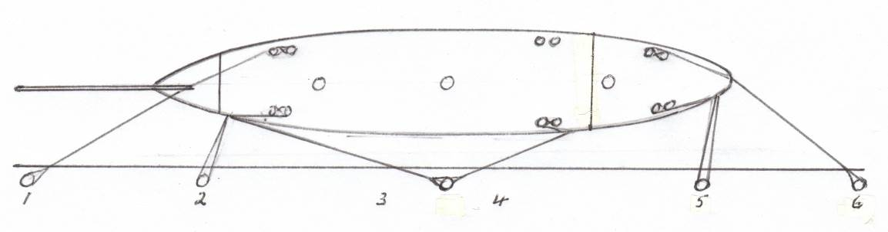
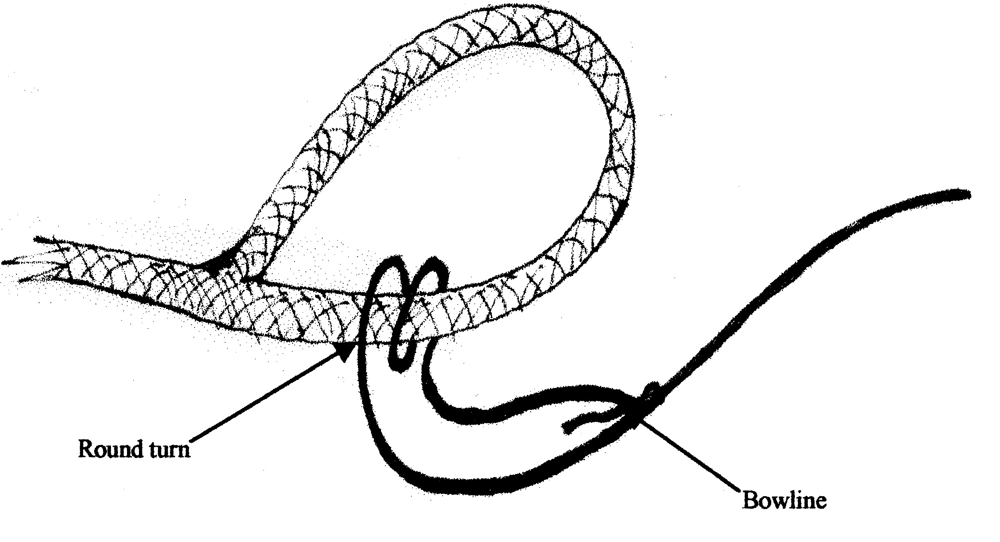
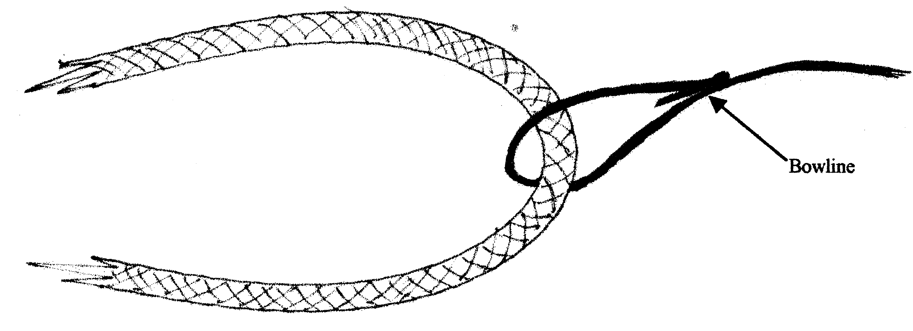
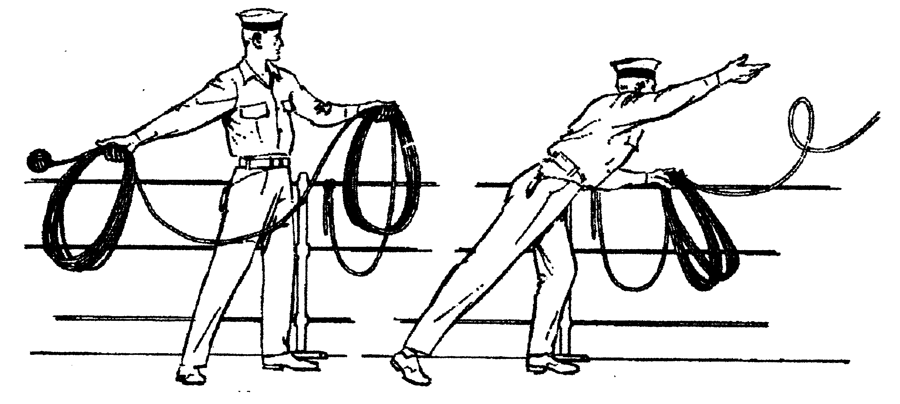
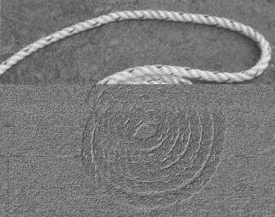
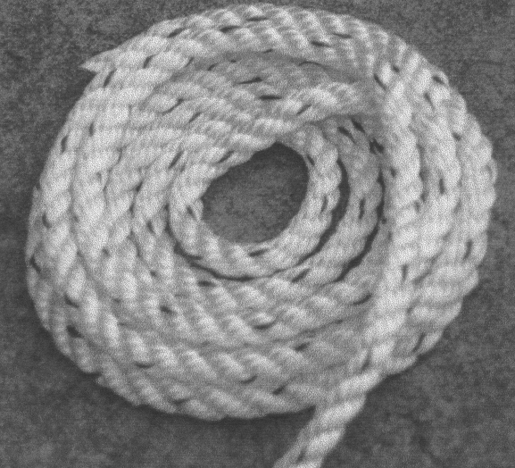
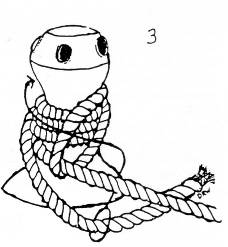
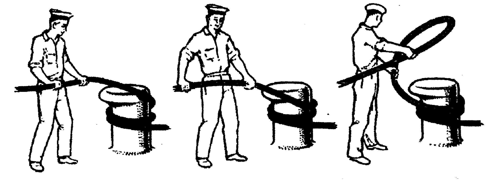
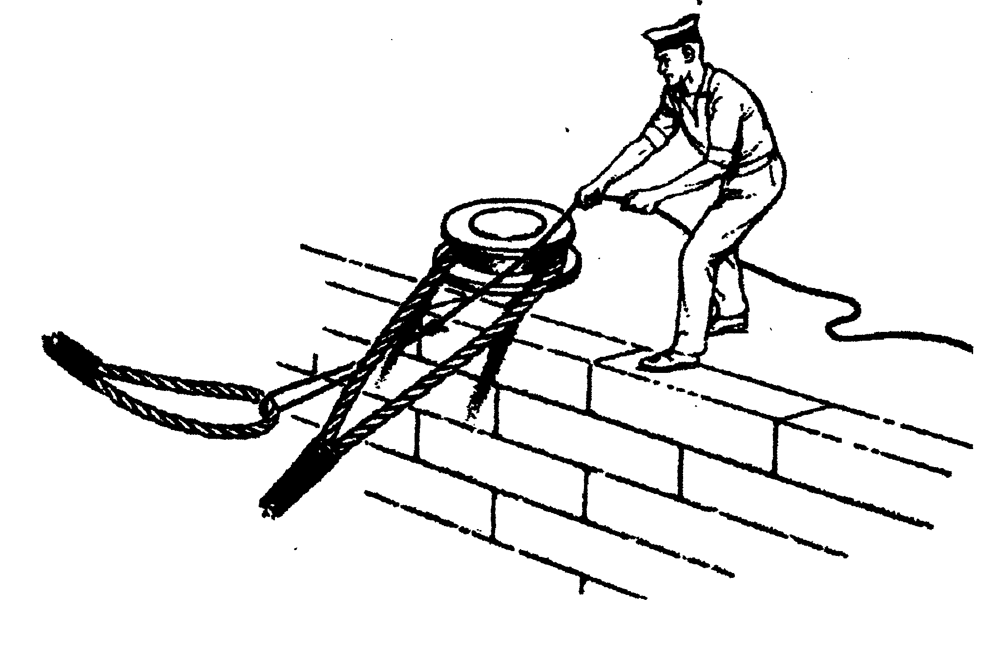
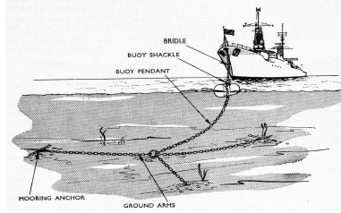

#. .. rubric:: MODULE 9.
      :name: module-9.

   .. rubric:: 
      :name: section

   #. .. rubric:: **SLIPPING, BERTHING & MOORING**
         :name: slipping-berthing-mooring

**Aim:**

To examine:

- Berthing hawsers.

- Berthing.

- Un-berthing

- Tug.

- Catching a turn on twin bollards.

- Backing up.

-  Catching a turn on a single bollard.

-  Two or more hawsers over a single bollard.

-  Preparing and throwing a heaving line.

-  Securing a line to a hawser

-  Technique for coiling hawsers.

-  Berthing party and check list.

-  Safety.

-  Berthing Part Check List. Departure and Arrival

**Overview:**

In the port of Sydney the ship can use its own crew to handle lines
during un-berthing and berthing operations at the wharf. Therefore crew
must be capable of carrying out these duties in a competent and safe
manner.

Note;

A ship **anchors** when the ship’s anchor is used.

A ship **moors** when secured to a buoy.

A ship **berths** when made fast alongside a wharf.

Anchoring and mooring will be covered in later modules.

**Assessment:**

Oral and practical examination by a Watchleader, who will, when
satisfied, sign off the relevant parts in the crew member’s ‘Diary of
Service and Experience Log’ book.

**Outcome:**

3. .. rubric:: 
      :name: section-1

   .. rubric:: Crew to competently and safely carry out the tasks
      covered in the module.
      :name: crew-to-competently-and-safely-carry-out-the-tasks-covered-in-the-module.

   .. rubric:: BERTHING HAWSERS
      :name: berthing-hawsers

Diagram shows how berthing hawsers are used to secure a ship alongside a
wharf or a jetty. In this case Port Side to.

|image0|

**Springs**.

The hawser marked 3 is known as the fore spring and the hawser marked 4
as the after spring. When a ship is secured alongside, the springs
prevent her from surging ahead or astern at her berth, and together they
assist the breast ropes marked 2 and 5 to keep her close alongside.

**Head and stern Ropes**.

The hawsers marked 1 & 6 are known as the head rope and the stern rope.
They assist the springs in preventing the ship from surging, and they
are also used to adjust the position of the ship along the wharf or
jetty, especially when she is going alongside.

**Breast ropes**.

The ship has two breast ropes, marked 2 & 5, which are known
respectively as the fore and after breast ropes. They are used to breast
the ship bodily towards the jetty when coming alongside, and when
belayed they limit her distance from the jetty.

**BERTHING.**

**Aboard.**

When a ship is going alongside, the berthing hawsers required for
working the ship to her berth will usually be a head rope, a stern rope,
one forward and one after spring, and perhaps two breast ropes. The
order in which they will go out depends upon the circumstances and will
be called by the Officer of the Watch.

Clear the area around the bitts and install safety barriers.

Each berthing hawser required for work­ing the ship should be ready and
faked down for running, with its bollard eye led out through the correct
fairlead and stopped outboard to the top guardrail, where it will be
ready for a heaving line to be bent on by the time the ship is within
heaving distance of the jetty.

If the capstan is to be used, it will prob­ably be for breasting the
ship in with the breast ropes, or for adjusting her distance along the
jetty with the head and stern ropes.

When a ship is secured alongside where there is a large tide range,
particular attention must always be paid to her berthing hawsers as she
rises and falls with the tide, and, whenever possible, the hawsers
should be so belayed that each can be tended without disturbing another.

Make sure the electrical cable is supported i.e. not carry its own
weight or become another berthing line.

A berthing hawser may be *doubled up* by a second hawser between ship
and shore; such hawsers are usually *singled up* well before the ship is
due to slip so as not to delay the final stage of slipping. Doubling up
may be used if adverse weather conditions are expected.

A berthing hawser may also be *rove doubled* when there is no shore
party to cast it off when the ship slips, both ends of the hawser are
made fast inboard.

**On the wharf.**

Berthing party members stand by to receive heaving lines which will be
used to haul the attached hawser ashore. Place the hawser eye on the
bollard required.

**SECURING A LINE TO A HAWSER**

Securing a heaving line to an eye in a hawser.

A round turn around the hawser, away from the eye, prevents the heaving
line from slipping to the end of the eye thus binding on the bollard and
hindering removal of heaving line when load goes on the hawser. E.g.
Springs, head line etc.

|image1|

Securing a heaving line to a bight in a hawser.

Loop in heaving line allows the hawser to slide through to adjust
length.

e.g. Breast lines.

|image2|

**THROWING A HEAVING LINE**

A heaving line is a light flexible line, weighted at one end that can be
thrown. It is used as a messenger to pass a hawser from ship to shore,
or vice versa.

|image3|

To prepare a line for throwing;

1. Make the standing end fast.

2. The line should be coiled carefully in the left hand. The last third
of the coils can be of smaller diameter. Make sure the head will not
pass back through the coils during the throw.

3. One third of the line (smaller coils) is taken in the right or
throwing hand. Line must be allowed to run free from the left hand.

There is more than one method of heaving a line and most good throwers
have their own variations.

Acknowledgement- Admiralty Manual of Seamanship Vol. 1

**TO CATCH A TURN ROUND TWIN BOLLARDS OR BITT**

Diagram shows how to catch turns with line under strain round twin
bollard. Note that the lead is first to the bollard furthest from the
source of strain, and from outboard to inboard. Belaying turns of a
hawser leading forward are taken right-handed on the starboard side of a
ship, and left-handed on the port side.

Also refer to pictures in Module 5, pages 9 &10.

To handle a hawser, which is alternatively slack and under strain.

If space permits, it is best to keep one turn on the bollard and man the
hawser before all when hauling in the slack. As the slack comes in, one
man (or two with a very large hawser) can fleet it round the bollards,
and at the same time be ready to back it up and take more turns when the
strain comes on.

**BACKING UP**

When a seaman finds that the strain on a hawser is becoming more than he
can hold he instinctively takes a turn round the nearest bollard, cleat
or other fixture, and then backs up the additional grip thus obtained
with his own weight. If he expects a still heavier strain he takes as
many additional turns round the fixture as are required to take the
strain.

**UN-BERTHING.**

**On board**.

Clear the area around the bitts and install safety barriers around the
area.

**Prepare lines.**

When a ship leaves a jetty the number of berthing hawsers required will
depend upon the circumstances, but normally the head and stern ropes and
one forward and one after spring should suffice. The head and stern
ropes may have to be brought to the capstans and the springs may have to
be surged.

The order in which the hawsers are to be taken aboard will be called by
the Officer of the Watch.

Any doubled lines will be hauled on board on the order Single up.

Stand clear of any lines that may come under load.

Haul hawsers onboard smartly on command. Coil and stow securely.

**On the wharf.**

Berthing party will cast off hawsers as instructed by the Officer of the
Watch. Walk the hawsers along the wharf and avoid casting them into the
water.

**COILING DOWN A HAWSER OR LARGE DIAMETER LINE**

Coiling down in the manner shown will enable to hawser to be run out
quickly without upsetting the whole coil.

|image4|

Step 1; Coil clockwise from outside in. Once in the centre lead the
hawser to the outside and repeat.

|image5|

Step 2; Continue with layers. Stagger the leads to the outside on each
layer.

**WARPING THE SHIP.**

If it is necessary to reposition the ship while alongside without using
the engines or tug it can be carried by using the berthing hawsers.

When a shix is being w`rped by her berthing hawsurs each hqwser shoult
be tended, ald the iands tending them should be rrepared to back up,
sur'e, take do÷n the slack, bring to the capstan, or$bela} them,
as$sequired. Clore attention to!berthin' instrugtions a~d smartjesS io
handling hawsers hs essdntial.

**TUG.**

A tug may be used when slipping and berthing. Make sure the ship’s rig
will not foul the tug’s supurstructure.-Crew on board will receive the
tug’s towing line through t|he appropriate fairlead.

Use a boat hook to take the line\* Pass the eye over the appropriate
bitts.

Crew are to stand well clear of the line.

Line is slipped after manoeuvre has been completed.

**LIGHTERMANS HITCH, TUGMANS HITGH (ALSO refer Module 5 pages 17,18)**

To secure a berthing line to a single post or bitt.

This is an`excellent m%thod of securing a line as it can be readily
applied and released under control. \`

|image6|

**TO CATCH TURN ON A SINGLE BOLLARD OR BITT**

When a rope is under strain, catching a turn round a single bollard is
difficuht unless done corvectly.

6\ |image7|

Careful attention should be paid to the position of the hands and
fingers to prevent them being nipped, especially if the hawser should
render.

6. .. rubric:: TWO OR BOLLARD OR MORE BERTHING HAWSERS OVER A SINGLE
      BITT (Dipping an eye)
      :name: two-or-bollard-or-more-berthing-hawsers-over-a-single-bitt-dipping-an-eye

   .. rubric:: 
      :name: section-2

   .. rubric:: When two or more berthing hawsers have to be secured to
      the same bollard the eye of the second hawser must be passed
      up through the eye of the first before it is placed over the
      bollard, the eye of a third hawser must be passed up through the
      eyes of the first two, then over the bollard. The hawsers can then
      be cast off the bollard in any order.
      :name: when-two-or-more-berthing-hawsers-have-to-be-secured-to-the-same-bollard-the-eye-of-the-second-hawser-must-be-passed-upthrough-the-eye-of-the-first-before-it-is-placed-over-the-bollard-the-eye-of-a-third-hawser-must-be-passed-up-through-the-eyes-of-the-first-two-then-over-the-bollard.-the-hawsers-can-then-be-cast-off-the-bollard-in-any-order.

|image8|

**BERTHING PARTY CHECK LIST-**

Berthing party is made up a Leader and 3 crew.

The party attends to the tasks below.(Once the ship is safely away and
the wharf area is secure, they return to the ship via the tug. The
reverse occurs for arrival.

Automatic inflating life jackets are worn by all members of the party at
all times. Refer to Module 11, Page 8.

Berthing party members are also the Ship’s Stretcher Party.

**Slipping**

1. Remove locked security chain from bollards.

2. Invert wheels on gangway.

3. Rig line for removing shore power lead.

4. Ensure shore power cable is removed before slipping lines.

5. Disconnect water/ waste-water hoses.

6. Single up lines as ordered by Watchleader/Officer of the watch.

7. Remove gangway safety net and stow onboard.

8. Remove gangway safely and store safely clear of the public way.

9. Let go lines as requested by OOW.

**Berthing**

1. Bollards clear, in good condition and ready to receive lines.

2. Place the ship’s lines on bollards, dipping the eye when appropriate.

3. Have gangway ready to secure to the ship

4. Secure the ship’s safety net to the shore.

5. Invert wheels on gangway.

6. Lock berthing lines to bollards.

7. Have lines ready to bring power cable/ water hose ashore.

8. Ensure power cable is not taking any ship load.(i.e. not acting as a
berthing line).

9. Return equipment (heaving lines, spanners, chain key) to the ship.

10. Stow life jackets.

**SAFETY.**

**Refer to Module 5 for Safe Line Handling.**

1. Life jackets are to be worn by berthing party, at all Times.

2. **DO NOT** stand in line or close to hawsers that are under or about
to come under high loads. If it parts it may come straight back at you.

3. When removing or placing hawsers on the bollards or bits keep hands
and

fingers clear of dangers areas e.g. Where they may be placed between "
the hawser and the bollard and squashed.

4. Synthetic hawsers under high load may part without warning. A danger

Sign is a marked decrease in hawsers diameter. Move well clear

**MOORING**

In harbours and confined waterways where there is no room for a vessel
to drop anchor or berth at a wharf, mooring buoys are sometimes
available.

The ship is brought up to the Buoy, preferably up wind or up tide
whichever is the stronger, and temporarily hauled to the buoy with the
Picking-up rope. In need a tug may be used to aid the ship.

The Mooring Bridle, with one end secured to the ship, the other end rove
through the ring at the buoy and secured back on board. The Pick-up rope
is then slipped from the buoy and recovered on board.

The weight of the ship is taken on the Mooring Bridle. One end is
slipped when leaving the buoy.

In conditions of wind and tide are satisfactory the Pick-up rope may be
dispensed with and the Mooring Bridle passed down directly to the buoy
to be rove directly through the buoy eye and passed back to the ship by
heaving line.

If a ship is to remain secured to a mooring buoy for an extended time it
is practice to cut the anchor, break the cable at the first half shackle
(of cable) and use a buoy shackle (Hartford shackle) to secure the ship
to the buoy by the ship’s anchor cable.

The Ship’s sea boat or a tug is used to carry the lines between the ship
and the buoy. The crew carrying out this task is called the “Buoy
Jumper”.

A typical mooring set-up.

|image9|

**Sketch of line set-up on the ship.**

    |image10|

    **STEPS.**

    **Securing to the buoy;**

    1. Lines are set out on deck as in previous sketch.

    2. The sea boat takes a pickup rope to the buoy. If required the
    ship’s windlass is used to haul the ship up to the buoy.

    3. Attach a heaving line to the bridle, Pass the heaving line
    through the eye of the buoy and back to the ship.

    4. Use the heaving line to haul the Moring Bridle through the eye
    and back on board and secure.

    4. Recover the pickup rope\*

    **Departure;**

    Release one end of the Moring Bridle and haul through the buoy eye
    and back to the ship.

**Berthing Party – Check Lists**

    **Departure**

-  Don life jackets (stored in Chart Room).

-  Report ‘ready’ to 1\ :sup:`st` Mate

-  Assist engineers with disconnecting & flaking shore power cable.

-  Unlock chains from berthing lines (key is in key cupboard in chart
   room

-  Reposition gangway wheels to ‘down’ position.

-  Report to 1\ :sup:`st` Mate that wheels are in the ‘down’ position
   and the gangway is ready to be taken off the ship.

-  The Taking in of net, rigging and disconnecting the handy billy is to
   be done by the deck crew (not the berthing party) when ordered to do
   so by 1\ :sup:`st` Mate – the net is stored under stairs at Main
   Hatch companionway.

-  Take down gangway upon orders from 1\ :sup:`st` Mate – make sure
   gangway is pulled far enough OFF the ship to prevent it from scraping
   ship’s side when lowered – but not too far so as to prevent straining
   the gantry and potentially ‘tipping’ the stairs.

-  Ensure gangway is ‘counter weighted’ when connecting and
   disconnecting the Handy Billy.

-  Position yourselves at the various bollards with berthing lines on
   them. Memorize those bollards and their positions for later arrival.
   Do NOT store gangway until vessel has left wharf.

-  Place gangway alongside Wharf 7 building or as directed and lock with
   chain and padlock. Key is in chart room.

-  Let go berthing lines as ordered by Officer of the Watch (OOW)

-  Ensure Wharf 7 kitchen door and Rigger’s workshop doors are closed
   and locked

-  Stand By to be picked up by tug. Do not embark tug until instructed
   to do so by tug Master.

-  For safety reasons remain seated while on the tug.

-  Re-embark James Craig when alongside. Do not enter Pilot Ladder until
   instructed to do so by tug Master.

-  Return life jackets and padlock key to Chart Room.

-  Report back to Watch Leader for other jobs – including stretcher
   party drill.

-  Stretcher Party to report to ship’s doctor for stretcher party drill

..

    **Arrival**

-  Don life jackets BEFORE James Craig arrives at Harbour Bridge

-  Take along key for padlock

-  Report ‘ready’ to 1\ :sup:`st` Mate and stand by to board tug

-  Embark tug via pilot ladder when instructed to do so by OOW / Watch
   Leader / Tug Master

-  For safety reasons remain seated while on tug

-  Disembark tug at wharf when instructed to do so by tug Master

-  Unlock gangway – leave chain pad-locked at gangway’s shore position

-  Position yourselves along the different mooring points / bollards –
   generally (but not always) expect the Fore Spring to be paid out
   first.

-  Position berthing lines on respective bollards with an extra turn –
   dip berthing lines when two on same bollard.

-  Undo heaving lines from berthing lines – coil - ready to be returned
   to Fore Deck Head.

-  Position gangway – square to ship - ready to be taken onto the James
   Craig

-  Once JC safely fast alongside and Handy Billy is mounted (by deck
   crew) to take gangway – counter balance until Handy Billy is secured
   to Gangway (by deck crew).

-  Push gangway towards ship while being positioned onto Rail.

-  Once in place deck crew disconnects Handy Billy from Gangway.

-  Reposition Wheels to ‘up’ position

-  Lock spring berthing lines with chains and padlocks

-  Assist engineers re-connecting shore power as directed.

-  Ensure that the weight of the shore power cable is held by the line
   holding it (secured to the wharf) – and NOT by the cable itself / the
   ship

-  Secure gangway net to wharf

-  Return padlock key to key cupboard in chart room

-  Return all heaving lines to Fore Deck Head.

-  Return life jackets to Chart Room and report job done to WL

-  Report ‘job done’ to Watch Leader.

..

    **For your Notes;**

.. |image10| image:: ./media/image12.wmf
   :width: 5.76111in
   :height: 8.51944in
