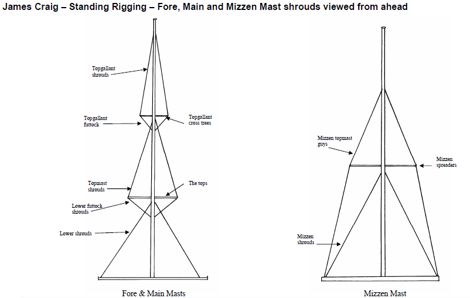

MODULE 4.

***************
Masts & Rigging
***************

**Aim:**

On completion of this module you will have an understanding of the
ship’s;

-  spars

-  masts and yards

-  standing rigging.

-  running rigging for spars and sails.

-  parts of typical square and fore and aft sails.

**Overview:**

Deck trainees are expected to work towards a sound awareness of spars,
rigging & lines.

On pages 8 to 13 diagrams show spars, standing rig and sails.

Annexure C contains blank diagrams that can be used to aid in memorising
the names of Masts, Rigging and Sails.

Qualified crew (Deckhands, Efficient Deckhands) need to be able to
name:-

- ship’s spars

- parts of the standing rigging

- ship's sails

- sail parts

- the lines that control the sails & spars (running rigging) and
where they are located pin rails.( Refer Module 5 – pages 22 to 24).

Although the above may seem formidable, a structured and systematic
approach to learning will facilitate the process.

This will involve:-

- identify spars

- identifying the rigging as standing, running and other (flag
halyards, gantlines), on fore, main and mizzen masts and jibboom.

- observing the principles and patterns that govern where lines fall utilising 'tools' such as these notes, rigging and pin diagrams.

**Assessment:**

Oral examination by a Watchleader who will, when satisfied, sign off
task in crew members ‘Diary of Service and Experience Log’ book.

**Outcome:**

Be able to identify and name the parts of the ship’s rig and able to
locate a required line or pin without hesitation.

Spars
=====

Spars – This is a general term for all wood and metal supports used in
rigging of a ship, it embraces all masts, yards, booms, gaffs etc.

Spars have standing rigging to keep them in place and support them.
Running rigging, on some, is used to control their position relative to
the ship and weather.

NOTE: Square rig ships were designed to work down wind, so you will note
that the majority of standing rigging and some running rigging is set to
support the masts etc from forward movement. The relatively few and
lighter fore stays act in the opposite direction. Therefore it is of the
utmost importance that the ship is not caught aback, i.e. head to wind.

+-----------------------+-----------------------+-----------------------+
| .. rubric:: Spars     | **Standing Rigging**  | **Running Rigging**   |
|    (Page 9)           | (Pages 10 to 12)      | (Page 5)              |
|    :name: spars-page- |                       |                       |
| 9                     |                       |                       |
+-----------------------+-----------------------+-----------------------+
| Masts                 | Athwart ship;         | Nil                   |
|                       |                       |                       |
|                       | Shrouds               |                       |
|                       |                       |                       |
|                       | Guys                  |                       |
|                       |                       |                       |
|                       | Fore support;         |                       |
|                       |                       |                       |
|                       | Fore stays            |                       |
|                       |                       |                       |
|                       | Jib stays             |                       |
|                       |                       |                       |
|                       | Aft support;          |                       |
|                       |                       |                       |
|                       | Backstays             |                       |
+-----------------------+-----------------------+-----------------------+
| Yards                 | Lifts (Page 3)        | Braces (Page 4)       |
|                       |                       |                       |
|                       |                       | Halyards (Hoisting    |
|                       |                       | yards only)           |
|                       |                       |                       |
|                       |                       | Downhauls (Upper      |
|                       |                       | topsail yard only)    |
+-----------------------+-----------------------+-----------------------+
| Booms                 | Topping lift          | Preventers (Page 5)   |
|                       |                       |                       |
|                       |                       | Note- Spanker is      |
|                       |                       | loose footed          |
|                       |                       | therefore spanker     |
|                       |                       | sheet is attached to  |
|                       |                       | the end of the boom   |
|                       |                       | not the sail,         |
+-----------------------+-----------------------+-----------------------+
| Gaff                  | Span                  | Vangs (Page 5)        |
+-----------------------+-----------------------+-----------------------+
| Bow sprit             | Bob stay              |                       |
|                       |                       |                       |
|                       | Bow sprit guys        |                       |
+-----------------------+-----------------------+-----------------------+
| Jibboom               | Martingale stays      |                       |
|                       |                       |                       |
|                       | Jib stays             |                       |
|                       |                       |                       |
|                       | Guys                  |                       |
+-----------------------+-----------------------+-----------------------+
| Davits/ other         |                       | Guys                  |
|                       |                       |                       |
|                       |                       | Falls                 |
+-----------------------+-----------------------+-----------------------+

The following diagrams show;

- Spars and the names they receive when they are in position.

- Standing rigging – shrouds and backstays to provide thwart ship and
forward

and aft stability for the masts..

- Standing rigging viewed from ahead

- Standing rigging – fore stays to prevent aft movement of the masts.

- Standing rigging for the bowsprit and jiboom.

- Running rigging for yards, boom and gaff

- Hoisting yards.

- Trimming yards.

|image0|

|image1|

|image2|

|image3|

|image4|

|image5|

Yards – Braces
==============

The angle of the yards to the ship is controlled by the braces (running
rigging) attached to the end of each yard. Refer to the diagram on the
previous page.

To locate the pins to which the running end of the braces are attached
on deck, refer to the pin diagrams in Module 5, pages 10,11 and 12.

Yard – Halyards
===============

Arrangement of yards on both masts.

NOTE. Lower two yards are fixed to the mast, upper three yards are
“hoisting yards”.

Acknowledgement – Masting & Rigging – Harold A. Underhill.

The upper topsail, topgallant and royal yards are supported, when
lowered, by their lifts (standing rigging).

Each yard is hoisted by a halyard (running rigging). The yard is
attached to the mast by a parral that slides on the mast.

Sails
=====

To set or take in sails some lines are eased while others are hauled.
The following tables illustrate these, in general terms. Sail Handling
Module 7 will cover sail handling in more detail.

Refer to page 13 for the sail plan.

Square sails running rigging
----------------------------

The head of a sail is lashed with robands to the jackstay on the yard.

+----------------------+--------------------------+
| **To Set, haul on;** | **To take in, haul on;** |
+----------------------+--------------------------+
| Tack                 | Clew lines               |
+----------------------+--------------------------+
| Sheets               | Leech lines              |
+----------------------+--------------------------+
| Yard halyards        | Bunts                    |
+----------------------+--------------------------+
|                      | Clew garnet              |
+----------------------+--------------------------+
|                      | Yard halyards (eased)    |
+----------------------+--------------------------+
|                      | Yard downhauls           |
+----------------------+--------------------------+

Fore and aft sails running rigging
----------------------------------

Sails are made fast at the tack, the luff lashed to hanks, hoops or a
jackstay, the clew is controlled by the sheets or outhaul, the head by a
halyard or outhaul and downhaul or inhaul.

+------------------+----------------------+
| **To set, use;** | **To take in, use**; |
+------------------+----------------------+
| Halyards         | Downhauls            |
+------------------+----------------------+
| Sheets           | Clew line            |
+------------------+----------------------+
| Outhauls         | Inhaul               |
+------------------+----------------------+
|                  | Brails               |
+------------------+----------------------+

Other running rigging & lines
-----------------------------

Some examples;

Painter Man rope Freeing line

Painter pendant Gantline Heaving line

Bowsing line Flag/ signal halyard Etc.

|image6|

Parts Of Typical Sails And Handling Lines
=========================================

Refer to diagram “Anatomy of a sail and spars” illustrated by James
Parbery,

More detail on running rigging for James Craig sails will be covered in
Module 7.

|image7|

|image8|

|image9|

|image10|

Rig Conventions
===============

Here are some of the internationally accepted conventions that govern
the positioning of lines and their belaying pins.

1. **The higher the sail, the further aft its lines belay**. 
  This provides the fairest lead for lines and avoids chafe, the sailing ship's greatest enemy.

2. **Sheets for the square sails belay around the mast.**  
  In accordance with convention 1, the lower topsail sheets will be on
  the forward side of the mast, followed by topgallant sheets and royal
  sheets being aftermost [#royalsheet]_. The reasoning is that a ship
  on its beam ends (knocked down) in a squall will need to let go
  sheets to reduce the pressure of wind on the sails. In such a
  situation, if the sheets were belayed to the main rails, the lee ones
  may be underwater.

3. **Clew garnets, clewlines, leechlines, buntlines and upper topsail downhauls (the “gear”) are belayed at the main rail amongst the shrouds.** 
  Lines controlling the course are grouped together, next aft is the group of lines controlling the lower topsail, then the upper topsail and so on. Aloft, the further inboard the source of the line, the further aft in the group on deck it will be
  found. This is why the leechlines and buntlines belay aft of the clew
  garnets, clewlines and downhauls.

4. **Halyards belay at the main rail.** 
  Convention 1 still applies. In
  addition, the square sail halyards belay on opposite sides when you
  compare fore and main masts. This is a custom that almost
  certainly comes from the days of fighting sailing ships with large
  crews. The same sails on each mast could be hoisted at the same
  time, by large numbers of crew running along the deck working
  space. The reasoning still holds good.

5. **The headsail halyards also alternate from port to starboard.**
  These halyards compete with the square sails for space at the main
  rail. The lowest headsail is the fore topmast staysail. The halyard
  belays at the starboard main rail just abaft of the fore royal lines.
  The inner jib is next, being on the port main rail, and so on.

6. **Main topgallant sheets belay at the main fife rail.** 
  Although the
  main lower topsail sheets belay at the base of the mast to the spider
  band, the topgallant sheets belay at the main fife rail. This provides
  easier working access.

7. **Staysails and Jib downhauls belay close to the ship's centre line**
  and so will be found on the anchor deck fife rail, fore mast spider
  band and the main mast fife rail. They belay on the same side as
  their sail’s halyard.

Despite these conventions, in nearly every ship you will find a few
lines belayed in non conforming places. This may be because the lead is such that the line chafes in its conventional place, or the way the pin rails were constructed, is not strictly traditional.

.. rubric:: Footnotes

.. [#royalsheet] James Craig royal sheets belay at the main rail rather than at the 
    base of each mast. This was due to the mainstay crowding the fore
    mast spider band, making it virtually impossible to belay the fore
    royal sheet. It was decided to belay this line at the main rail forward
    of the royal clewline. In order to preserve consistency, the main royal sheet was also*
    belayed at the main rail.
