**MODULE 6.**

*************
Working Aloft
*************

**Aim:**

To introduce crew to climbing and working aloft on board the ship.

Overview:

Working at height is potentially dangerous but risks can be reduced.

The Ship’s Executive insists that work aloft be carried out safely.

There is an obligation on crew to look out for themselves and their
shipmates.

A Doctors certificate is required before any climbing can be undertaken.

Doctor’s Certificate and Climb Approval have a currency of two years.

Crew members are required to disqualify themselves from climbing as soon
as they are aware of a personal impediment that could affect their
ability to climb and work aloft safely.

**At all times, while climbing and working in the ship’s rigging crew
are to be clipped on with at least one hook. Thus the two hooks are in
use all the time from the deck up, alternating hooks as you move
about.**

**NOTE; The equipment mentioned in this Module is for *Safety purposes
only*. It is NOT to be used to hold, support or suspend a wearer when
working aloft. A special harness is to be used for this purpose.**

For information on recovering crew from aloft, refer to Module 21.

**Contents:**

. Working aloft rules.

. Check list.

. Climbing Equipment.

    - Safety harness

    - Checking and fitting harness

    - Use

    - Care & maintenance

    - Static line equipment

. Climbing hints.

. Certification.

- Pass written (open book) test on the contents of this Module.

    - Complete a pre climb (closed book) check list before undertaking
    the

    practical test.

    - To gain basic certification it will be necessary to complete the
    practical

    “3 times over the tops and around the jibboom” exercise.

    - Full certification will be given after check climb at sea.

    - Read and sign approval and acknowledgment form.

Assessment:

**Open book written assessment** on the contents of this module.

**A closed book pre climb check list** is to be completed prior to
practical assessment.

**Physical and practical assessment.**

Crew will satisfactorily carry out a climbing exercise. i.e. (Climb the
shrouds, futtock shrouds to the tops. Cross over and descend on the
other side, 3 times. Then climb along the jib boom and return on the
other side.)

**Climbing assessment at sea.**

Successful completion of module is recorded in ‘Diary of Service and
Experience Log’ book.

**Climber grading**

*Topman (TM)* – A crew member totally competent and capable al all
levels of climbing and tasks in the rig.

*Climber (C)* – Crew competent at all routine activities on all spars
aloft and the jibboom.

*Climber Deck (CD)* – Competent at low level climbing such as the
topgallant rail, shrouds below the tops, jibboom, anchor deck and mizzen
shrouds for stern lookout.

*Harness (H)* – Minimum qualification to be held by all crew. Capable of
fitting a safety harness. Essentially a non climber.

**Outcomes:**

For crew to competently inspect and fit climbing harness and lanyards.

To competently and safely climb in the rigging of the James Craig.

Working Aloft Rules
===================

It is **not** compulsory for all crew to climb, however **all** crew
will complete the training and be aware of the rules, especially those
who volunteer and wish to be sent and go aloft on the masts and out on
the jibboom. Crew are going to spend a lot of time aloft in all types of
weather and the sooner they get used to it the easier it will be.

You will be shown how to put on your safety harness, (refer to next
section) and told what to do and what not to do based on the following.

Climbing
--------

- **No crewmember is to climb into the rig of the ship without approval
  of their watchleader who will clear with the officer of the watch.**

-  Always use the weather rigging.

  a. The wind is keeping it more rigid than the lee rigging.

  b. If the ship is heeling it is at a better angle.

  c. The yards and sails will be clear of the rigging.

- Use the shrouds as handholds, NOT the ratlines that can break or
  someone may step on your hands. Also, our hand-grip is to stop us from
  swinging out, so something firm and something we can slide our hand up
  and down should be used: that's the shrouds.

- It is important to “walk” up and over with legs rather than
  pulling up using arms/upper body.

- Do not use knees to climb onto the tops.

- Clip on to static safety lines where fitted.

- When climbing aloft never let go with one hand until you have a
  good grip with the other. Always remember one hand for yourself and one
  hand for the ship. You have four available points of contact when you
  are going aloft, two feet and two hands. Always have three in contact
  with the rig. Do not overreach.

- Use both hands when climbing. Do not carrying anything aloft in
  your hands while climbing. Haul tools etc aloft later.

- Never use running rigging as a grip as someone on deck may let it
  go without warning.

- Never clip onto any running rigging or to a vertical part of the
  standing rigging which will merely give you a rapid guided descent to
  the deck. Best advice is, do not fall from aloft.

- Using clips. Reach up and clip on. Climb until the clip is level
  with your waist then reach up with the other clip and clip on. Un-clip
  the first clip and climb. Repeat the process.

- Straddle a shroud with your feet, do not have both feet on the one
  ratline.

- When working aloft clip your safety harness to the safety line
  that runs along the back of the yards or to a part of the rig that will
  not move, such as the jackstay on a yard, or a fitting on the mast where
  you are working.

- When waiting behind another crewmember, clip on and maintain a
  safe distance below the other climber.

- At all times, while climbing and working in the ship’s rigging
  crew are to be clipped on with at least one hook. Thus the two hooks are
  in use all the time from the deck up, alternating hooks as you move
  about.

- When stepping onto braced yards, use both hooks. One on the
  shrouds while clipping the other onto yard safety wire.

- Do not drop your hooks as there may be someone below you.

- Call when clear of the tops on the way up or down.

Moving onto and along yards
---------------------------

- Get on and off footropes carefully or you may bounce a shipmate
  off a yard.

- When laying out onto or leaving a yard, call to others “Stepping
  out starboard (or port)"or "Stepping off starboard (or port)”. Get an
  acknowledgement from the climbers on the yard, do not just talk to the
  mast in front of you.

- Only go onto hoisted yards with the Watch Leader’s approval (the
  Watch Leader will have or will get approval from the Officer of the
  Watch).

  Precautions 

  - Halyards have been made fast.

  - Braces are taut

  Dangers 

  - Halyards parting

  - Un-announced use of halyards.

- When going out on a hoisting yard make certain it is in its lifts
  and the braces are set up taut. Yards can get stuck, and your extra
  weight will bring it down with a jerk that can easily throw you off. If
  the braces are slack the yard will jerk as the ship rolls and again this
  can throw you off.

- When laying out on a yard, hold on to the jackstay, which is on
  top of the yard.

    **Caution; with the sail furled on top of the yard, extreme care should
    be used when selecting a handhold.**

- Never use the following as handholds:

  - A gasket, as it may be loose and give way.

  - The bight of a sail, as the wind may suddenly get into it.

  - The bunt-lines may not be made fast down on deck.

  - The safety line, as you can push others off the yard.

- Never stand on a yard or straddle it unless ordered to for some
  special task and, when you do, use great care. Think what you will do if
  the sail suddenly fills with wind, so always have a good grip of a part
  of the standing rigging.

- Climb directly up or down between the lower and upper topsail
  yards should only be undertaken by crew who a comfortable with the
  procedure. DO NOT USE THE SAFETY WIRES AS FOOT ROPES.

- Use the stirrups as a good point for ascending or descending.

Working sails on the yards
--------------------------

- When loosing or furling sails, remember, loose from lee, furl from
  windward.

- When casting off gaskets, make sure it is clear below before
  releasing gasket or gasket coil, call warning "Rope below" before
  dropping the gasket.

- Do not cast off gaskets until the timber hitches of ALL the gaskets on
  the yard are undone.

- When pushing a sail off a yard make certain that all the gaskets
  are off. If one is missed it will either carry away or more probably
  tear the sail.

- When loosing topsails, loose the lower topsail first then the
  upper topsail. The reverse applies when furling i.e. Furl the upper then
  the lower.

- When loosing an upper topsail make certain there is no one on the
  lower topsail yard before pushing it off into its gear.

- When the sail is in its gear always remember to coil the gasket
  and place it onto the fore side of the sail. A loose gasket can foul a
  clew line or buntline block and jam it. If this happens someone will
  have to go aloft and clear it whilst a thrashing sail tries to knock the
  person off.

- When calling instructions to the deck, be clear and concise.
  Attract attention with call “Ahoy on deck”.

Tools
-----

- When you take tools aloft always put them on lanyards and secures
  one end to your wrist or belt. You will also be working on gear aloft
  that cannot be attached to you such as shackles and pins, which are
  easily dropped with cold hands. If there is a potential danger of you
  dropping something shout loud and clear **“Stand from under”** so that
  anyone on deck has a chance to get out of the way.

General
-------

- At first you will be very careful working aloft but it is easy to
  relax and become over confident. Do not get casual or sooner or later
  you will come to grief so always obey these rules and never fool around
  aloft. It is a long way to the deck and few people survive the journey.

- The safety harness is a piece of equipment to protect you from
  hitting the deck if you slip when aloft.

- Always come on deck wearing it because you may be sent aloft
  without warning.

- No crewmember is to be aloft during departure from, or arrival at,
  a wharf.

- Do not change the position of another crewmember’s hook. Only with
  their permission and **they** must check.

**. Remember, at all times you must be attached to the rig from the deck
up.**

Working Aloft Check List
========================

Personal Check;

-  Health, are you fit?

-  No drugs or alcohol.

-  Clothing, warm with head cover.

-  Use sunscreen and keep hydrated.

-  Loose objects. Leave on deck or secure with a lanyard.

-  Harness. In good order and free of damage. Correctly fitted and
   comfortable.

-  Carry out buddy check (refer below).

On Deck;

-  Listen to orders.

-  Check that hoisting yards are in their lifts.

-  Check that braces are taut.

Buddy Check;

-  Look for twisted harness straps.

-  Harness buckles that are not secure.

-  Harness appears to fit correctly.

-  2 lanyards have been fitted.

-  Crewmember looks OK.

-  If there are any concerns refer to watch leader or officer of the
   watch.

-  When aloft keep an eye on your ship mates.

Climbing;

-  Use windward shrouds to climb.

-  Maintain 3 points of contact while climbing.

-  Do not carry anything aloft in your hands, they are for climbing.

-  Be clipped onto the rig or safety lines where provided, at all times.

-  Ratlines are for feet only. Use shrouds for handhold.

-  Do not use running rigging for handhold.

Working on Yards;

-  Clip onto safety lines.

-  Call when stepping onto and off a yard footrope.e.g. “Stepping on
   port”.

-  Call when loosing gaskets or gasket coils e.g. “Rope below”.

-  Work as a team and keep watch for your crewmates.

-  No standing on or astride yards.

-  When stepping down or up between topsail yards use caution.

Returning to deck;

- Do not jump from the pin rail to the deck.

- Report to your Watch leader.

- Report any damage you may have noticed in the rig.

- Have a drink of water.

**ABOVE ALL DO NOT BECOME COMPLACENT!**

Climbing Equipment
==================

**NOTE. This equipment is for safety purposes only. It is not to be used
as a working harness to support the wearer while working aloft.**

The equipment has three components;

1. Harness

2. Automatic locking fall arrest karabiner

3. Two lanyards, each with energy absorber, karabiner and 1 hook.

Harness
-------

|image0|

Checking and Fitting harness
----------------------------

1. Check the condition of the webbing and safety stitching. Look for
   cuts in the webbing, wear and damage due to use, to heat, and to contact
   with chemical products etc. If you are unsure of the harness’s
   condition, remove the harness assembly from service and present the
   harness to the first mate at sea or the “James Craig” operations manager
   alongside, for inspection by the rigger. 

   If in doubt do not use the harness

2. Ensure that the leg strap buckles are not obstructed and operate
   smoothly.

3. Check for correct locking of rapid action fast buckles. Point 5 in
   diagram above.

|image1| |image2|

4. Check sternal fall arrest loops for chafe or damage. Arrest point A3
   in diagram above.

5. Check rear fall attachment point for damage. Arrest point A2 in
   diagram above.

Sternal Fall Arrest Karabiner
^^^^^^^^^^^^^^^^^^^^^^^^^^^^^

6. The sternal fall arrest karabiner has a triple-action opening system
   with automatic locking. Slide the sleeve along the gate and turn it to
   unlock. The gate should open smoothly in one continuous motion.

|image3| |image4|

7. Check for damage and distortion. Do not use a damaged karabiner.

8. Fit to join the two harness loops as shown in diagram (e) below.

Fall arrest lanyard (with screw lock karabiner & hook)
^^^^^^^^^^^^^^^^^^^^^^^^^^^^^^^^^^^^^^^^^^^^^^^^^^^^^^

9. Check fall arrest lanyards, energy absorbers and hooks for damage and
   distortion.

10. Ensure that hooks are not damaged or bent and operate smoothly.

11. On each lanyard check that karabiner connecting lanyard and scaffold
    hook is closed and secure. You must not be able to open the nut by hand.

12. Report any defects/ damage. If in doubt do not use suspect lanyard,
    remove from service and present the assembly to the first mate at sea or
    the “James Craig” operations manager alongside for inspection by the
    rigger.

Fitting harness
^^^^^^^^^^^^^^^

Fitting diagrams.

|image5|

13. Diagram b – Put body on.

14. Diagram c – First adjust leg loops.

15. Diagram d - Adjust shoulder loops.

|image6| |image7|

16. Place fall arrest lanyards (2) onto fall arrest karabiner.

|image8|

17. Diagram e - Close the harness by clipping the sternal fall arrest
    karabiner through the sternal (front) fall arrest attachment loops.

18. Adjust harness to achieve the correct fitted position.

|image9|

19. Double check that karabiner is operating correctly and has closed
    correctly.

20. Carry out “buddy” check. (Refer to working aloft check list above.)

21. Test the harness prior to use, and before climbing aloft, by moving
    and hanging in it (but not from the fall arrest lanyard), from all
    attachment points to ensure harness is the correct size and fit and
    comfortable for use.

**Fall arrest lanyards should not be hung in as it can damage the fall
arrest mechanism.**

Fall arrest points in use
-------------------------

Back fall arrest point. Front fall arrest point

|image10| |image11|

Alternate hitching methods, good and bad.

|image12| |image13| |image14|

|image15| |image16|

Care and maintenance of equipment
---------------------------------

1. Do not drag harness or lanyards on the deck or ground.

2. Do not expose to high temperatures.

3. Do not expose to solvents, paints or strong cleaning compounds.

4. Avoid impacts, or rubbing against abrasive surfaces or sharp edges.

5. Wash off salt and dirt etc with soap and fresh water. Do not use
   solvents. Dry thoroughly before storing.

6. Lubricate hook and carabiner.

7. Store on rack.

8. Do not use a harness, lanyard or karabiner after a major fall or a
   major impact. Report the incident and present the equipment to the
   first mate at sea and the “James Craig” operations manager alongside
   for inspection by the rigger.

9. Do not carry out modifications to the harness or lanyards.

10. When stowing place scaffold hooks in the rear fall arrest attachment
    point and hang the harness on the rack pin using the fall arrest
    attachment point.

Static line climbing
====================

Fixed static lines have been installed on both sides of the fore and
main masts.

These are for ASAP travellers and are purely supplementary climbing
safety aid to expedite rig climbers ascending and descending the Main
and Fore Masts.

Setup
-----

Permanent black double braided static lines have been added to the rig.

The fore and main masts have 4 lines;

2 on port side and 2 on the starboard side.

In each case, one line runs from the pin rail to a point on the topmast
shrouds.

The second aft line runs from the pin rail to a point on the Royal Mast.

Each Static Line runs through a “Gate” just below the tops. The gates
hold the static lines close to the mast.

Climbers using the ASAPs will negotiate the gates with the ASAP as they
climb.

Refer to diagrams below for details of the ASAP and assembly.

Use
---

In use the ASAP links a climber to the Static Lines by a short lanyard
fitted with a shock absorber thus allowing the climber to ascend or
descent a mast unhindered. If a slip occurs the ASAP will lock to the
Static Line securing the climber.

1. Static lines and ASAPs’ are to be used as **safety device only**.

2. Fall system **is not** to be used to secure a climber while carrying
   out work aloft.

3. Number of crew on a static line at any one time – 3

Routine;

1. Static lines to be inspected before each sailing event.

  Check top anchor point.

  Check the full length of the static line. (Chafe, signs of inner core
  damage, case damage)

  Check for chafe where the lines cross the tops platform and at gate
  stations.

  Check deck level security – Damp/Rot etc.

2. Checks are to be carried out by a Watchleader/Bosun/Rigger.

3. Installation of arrestors is to be carried out by the
   Watchleader/Bosun.

3. At least 1 unit is to be located on the lee side static line (royal
   line) for emergency purposes.

Use by a climber
----------------

1. **Normal climbing requirements apply.**

2. The number of ASAP’s is limited so allocation of use is
   controlled by the Watchleader. Other climber use the established 2 hook
   system, especially for the lower yards such as the course.

3. When on the rail the ASAP is attached to the climber using its
   **short ASAP lanyard** to the sternal loop on the climbers harness.

  **DO NOT USE EITHER OF THE TWO HARNESS HOOKS TO ATTACH TO THE ASAP OR
  ASAP LANYARD.**

4. Climber can then ascent using the ASAP only.

5. Below the tops negotiate the “Gates”.

6. Proceed.

7. At desired yard transfer to the 2 line system.

8. Once disconnected from the ASAP clip the karabiner to a rat line
   to prevent the ASAP descending to the deck.

9. As the ASAP are attached to the static line any following
   climber, using the same line, wishing to go higher will have to transfer
   to the ASAP, leaving their ASAP, and proceeding.

   The reverse applies when descending.

10. When a climber returns to the deck the ASAP remains on the
    static line.

11. ALL SLIPS OR FALLS INVOLVING AN ASAP LOCK ARE TO BE REPORTED
    SO STATIC LINE CAN BE CHECKED FOR DAMAGE.**

Stowage and maintenance
-----------------------

1. Stowed in the bosun’s store (hung with free ventilation)

2. Washed and lubricated

3. Units to be inspected prior to each installation by Watchleader.

4. Register to be set up with inspection regime.

5. Units are removed from the static lines after an event, inspected and
   stowed.

Operation of equipment
----------------------

1. Connecting ASAP to the Static Line.

  |image17|

2. Fitting ASAP to the static line.

  |image18|

.. comment: TODO Missing comments from the diagrams.

3. How it locks in the event of a fall

  |image19|

  See point 4 for method to be used to release the lock.

4. Testing locking action.**

  Use a piece of test rope for this. To practice on a static line will
  lead to unnecessary ware on the Static Lines.

  |image20| |image21|

  |image22|

REMEMBER, ACTIVITIES AT HEIGHTS ARE DANGEROUS AND MAY LEAD TO SEVERE
INJURY OR EVEN DEATH. GAINING AN ADEQUATE APPRECIATION IN APPROPRIATE
TECHNIQUES AND METHODS OF PROTECTION IS YOUR OWN RESPONSIBILITY.

TAKE CARE OF THE EQUIPMENT AND ACT WITH CARE AT ALL TIMES.

ALSO REMEMBER, THE HARNESS YOU ARE PUTTING ON THIS TIME WILL HAVE BEEN
USED BY SOMEBODY ELSE – DID THEY LOOK AFTER IT???????

Climbing Hints
==============

1. Hook on at or above your position when climbing or working.

2. Keep hook close to your position to reduce the adverse results of
   “pendulum effect” in the event of a fall.

3. Avoid situations where hook could receive side loading in the event
   of a fall.

4. When working only use 1 lanyard. If 2 lanyards are use and a fall
   occurs, the shock absorbers may not function resulting in a sudden
   stop.

5. When hook is attached ensure jaw is completely closed and not fouled.

6. Do not drop your hook, when climbing, as you may hit the crew
   following.

Report Incidents
================

Report all falls or near misses to a Watch Leader or Officer.

Information gained may assist in providing information for other crew to
use and prevent a repeat.

Report any gear failure or anything else that does not appear to be in
order.

Record in the “Incident Book” located in the chart room.

Sydney Heritage Fleet - Approval To Go Aloft
============================================

NAME: …………………………………………………………………………..

I acknowledge that working aloft in the James Craig is potentially
dangerous and could result in serious injury or death.

I acknowledge that I have received training in the use of safety
harnesses and the safety requirements for working aloft in James Craig.

I agree to follow the James Craig climbing aloft policies and protocols
at all times

I have undertaken training and testing in this role \*and I confirm that
I have complete confidence in my ability to undertake tasks in the
rigging of the ship.

I am totally aware of the importance of safe working practices and the
need to be aware, at all times, of my own safety, the safety of my
crewmates working aloft and safety of passengers and crew below.

I am aware of the requirement that anything taken aloft is to be firmly
attached to a lanyard, which in turn, is affixed to my person.

I also affirm that I have a current Doctor's Certificate \* clearing me
to work aloft and agree that I will disclose to the James Craig Office
and my Watch Leader or Officer of the watch immediately if my health
rating were to preclude me working aloft in the future.

I acknowledge that the Doctor’s Certificate and this approval, are to be
renewed every two years.

\* Delete and initial if not appropriate.

SIGNED: …………………………………………

DATE: ………………………..

WORKING ALOFT –APPROVED AT LEVEL BELOW (Completed by assessor) Mark
appropriate box/s

\*Harness only:  \*Climber Deck (low level and jibboom):  \*Climber :


\*Topman :  \* Use of Ascender equipment:  \* Passenger climb: 

\* Refer definitions in Assessment Section of the Handbook.

+------------------+--------------------+
| Recorded; By;    | Recorded; By;      |
|                  |                    |
| Date / / ………………… | Date / / ………………….. |
+------------------+--------------------+

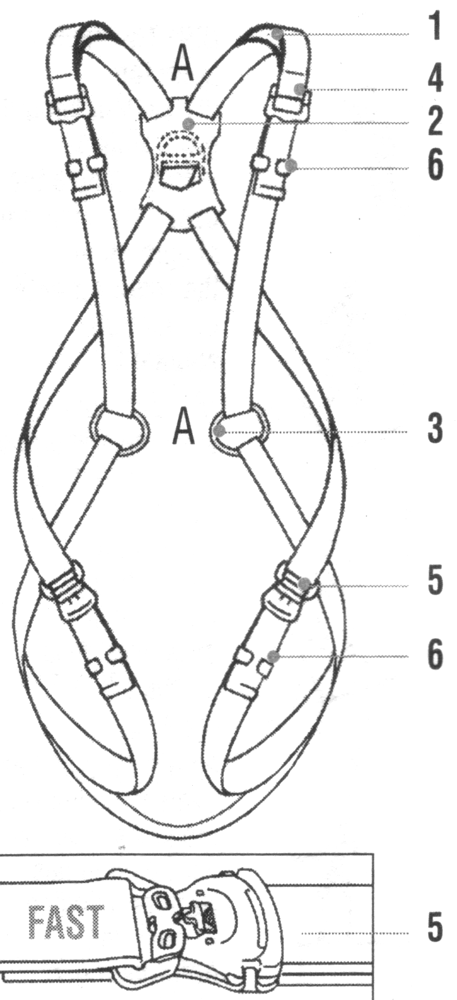
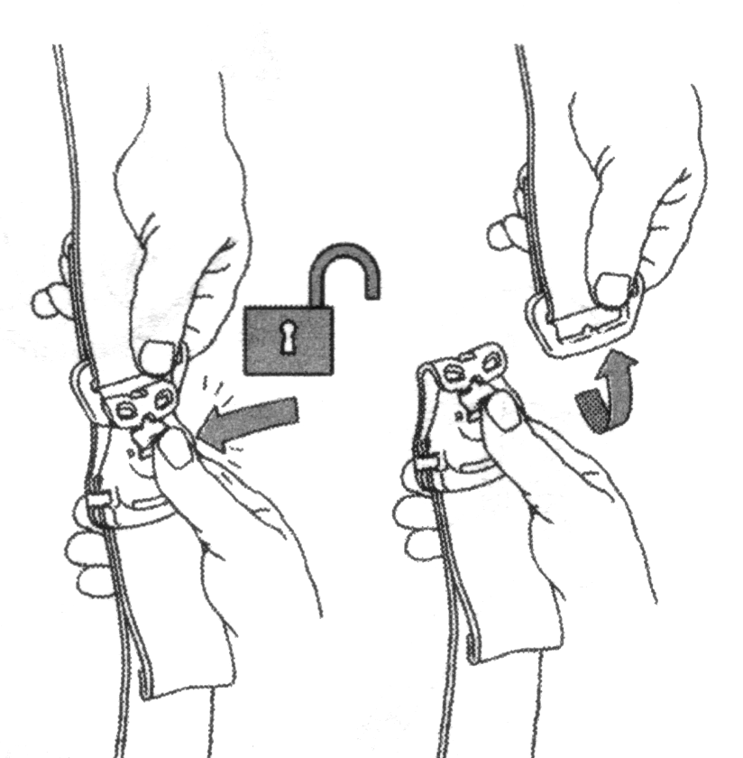
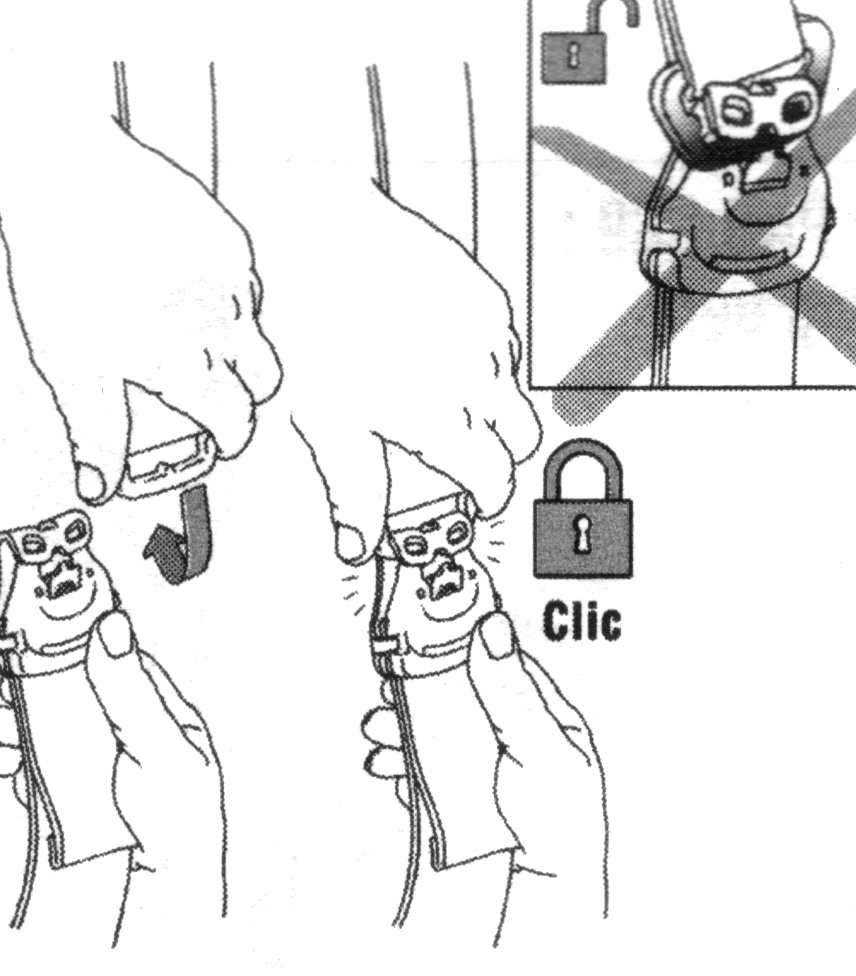
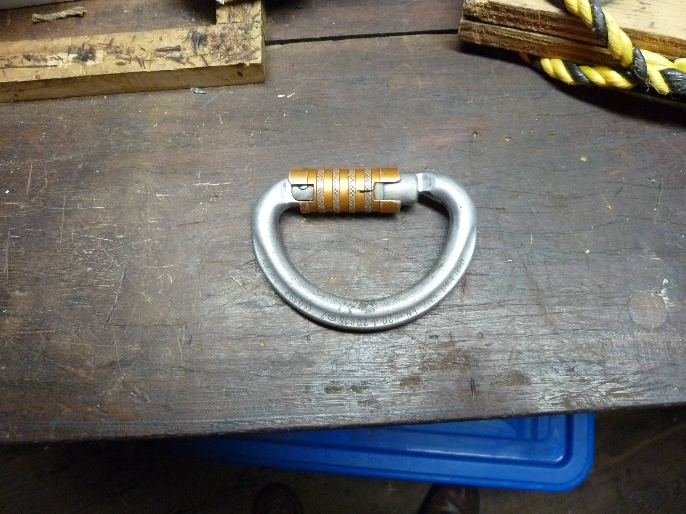
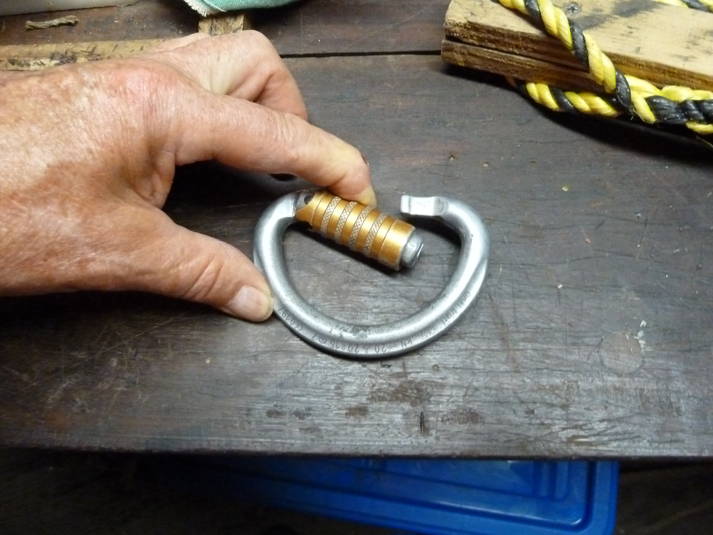
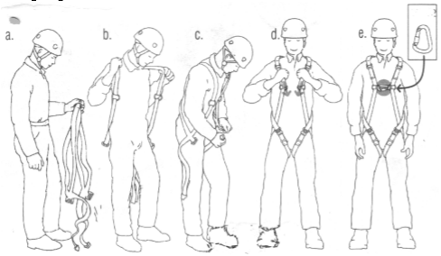
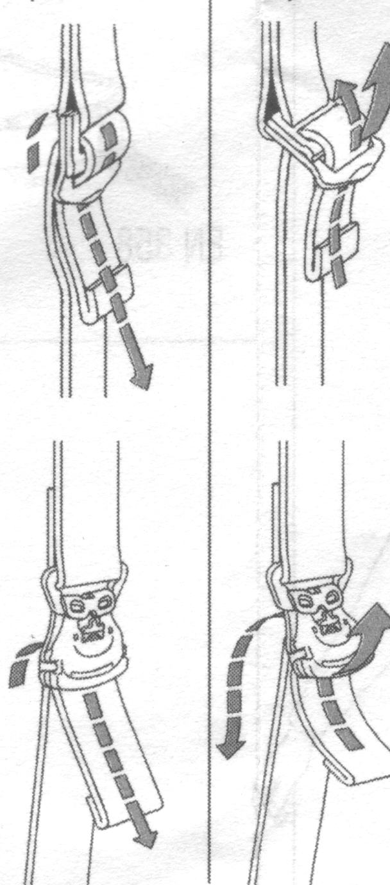
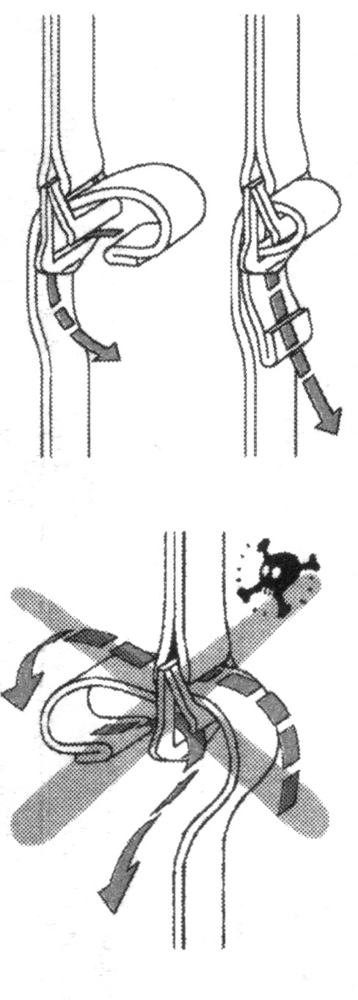
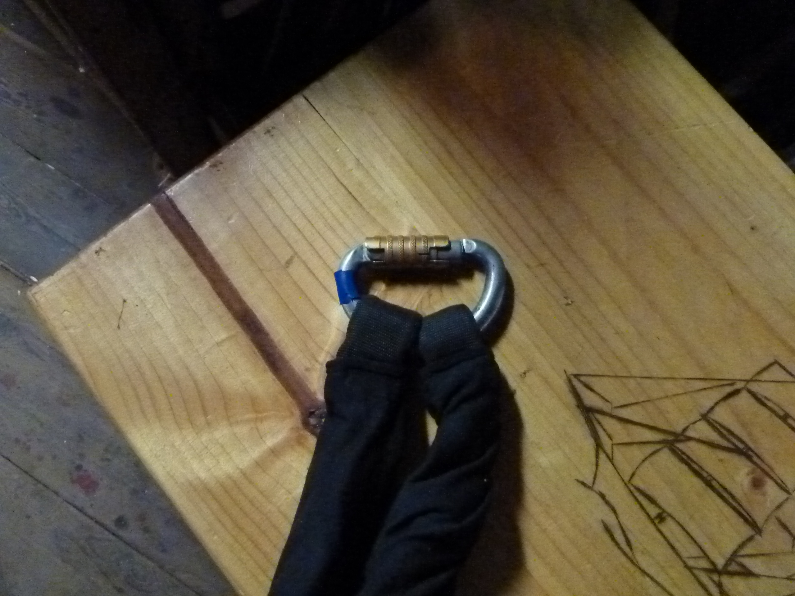
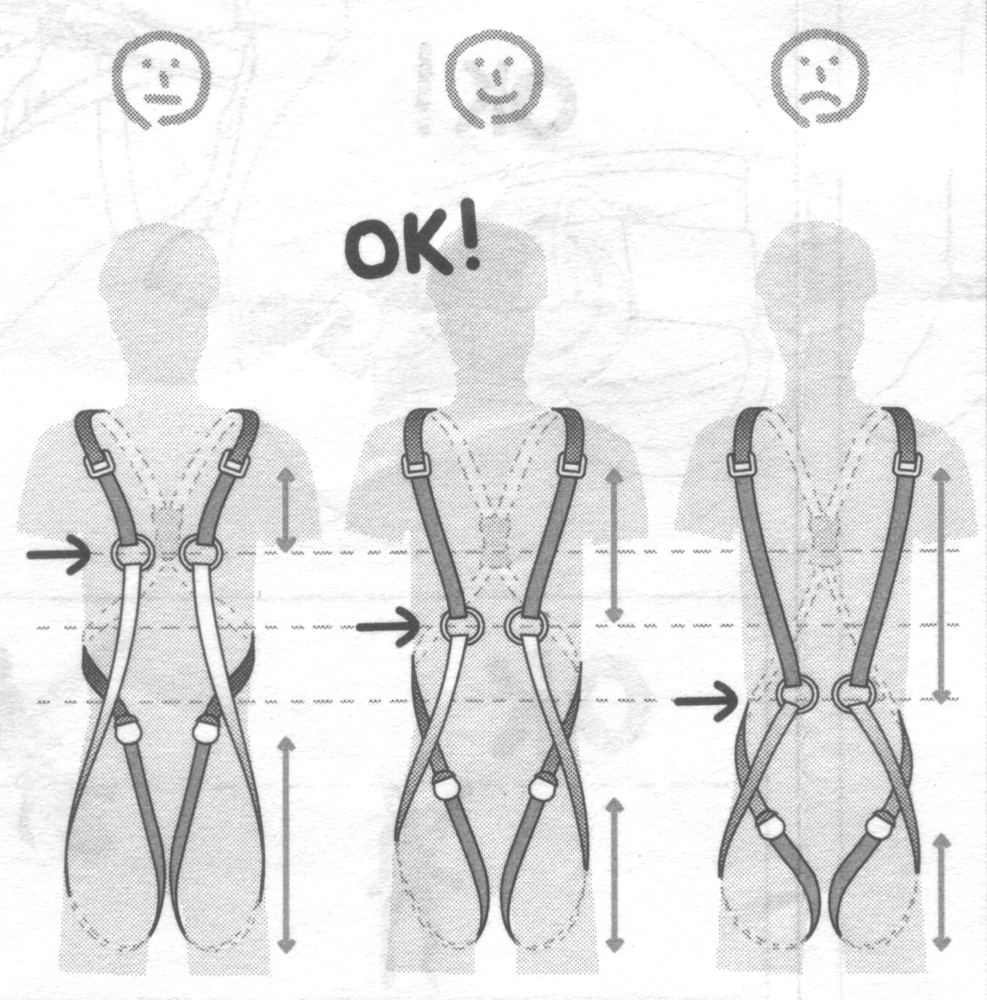
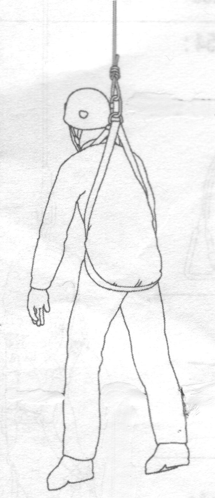
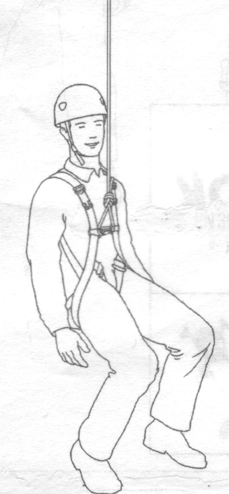
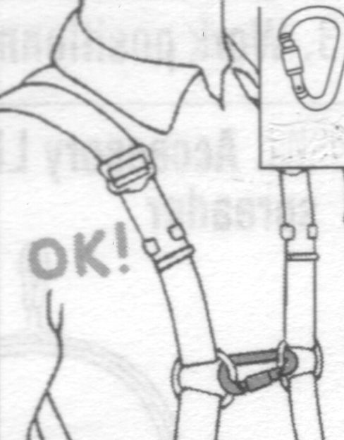
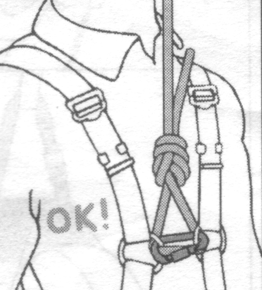
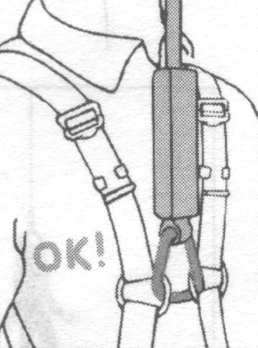
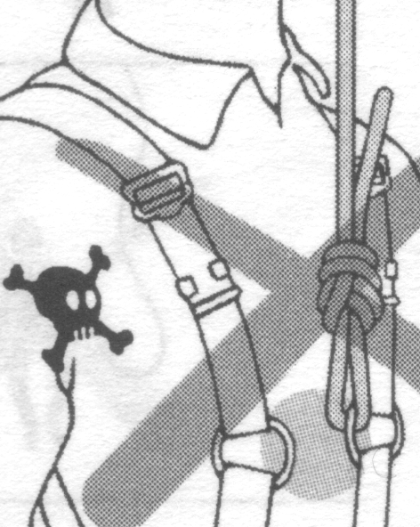
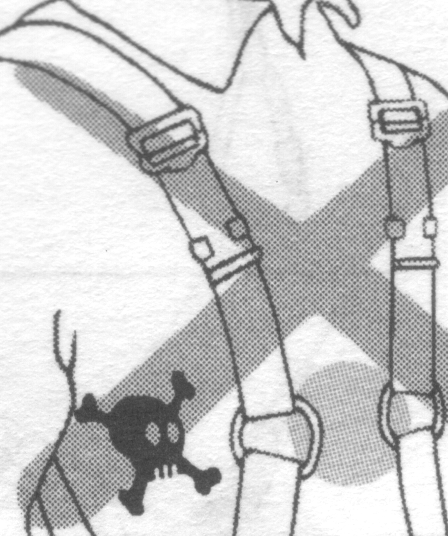
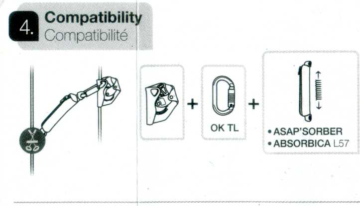
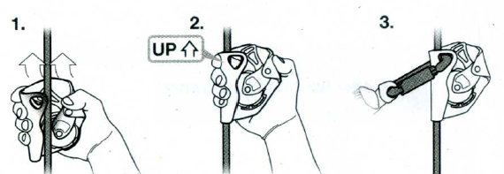
.. |image19| image:: ./media/image21.wmf
   :width: 4.69792in
   :height: 2.82222in
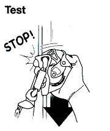
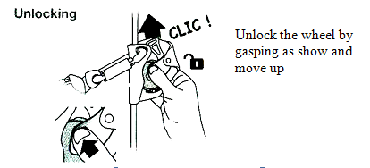
.. |image22| image:: ./media/image24.wmf
   :width: 4.52153in
   :height: 4.91181in
