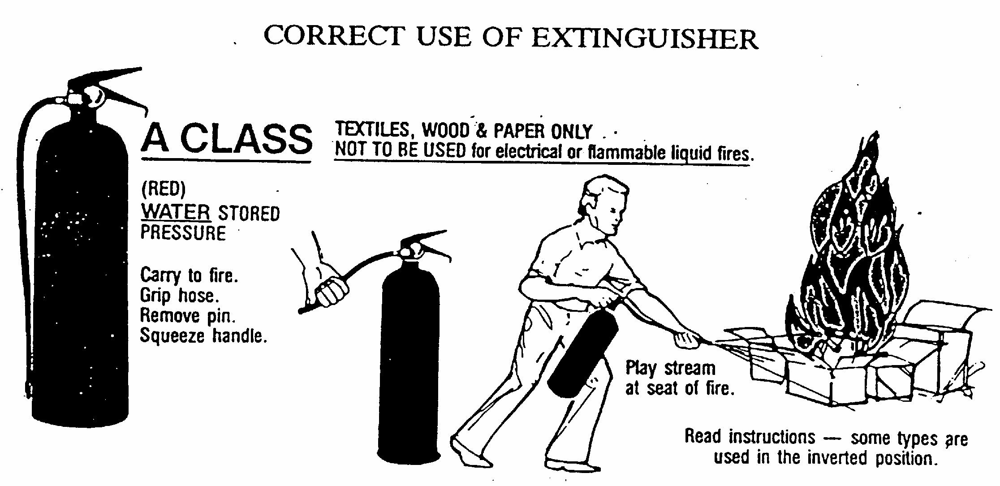
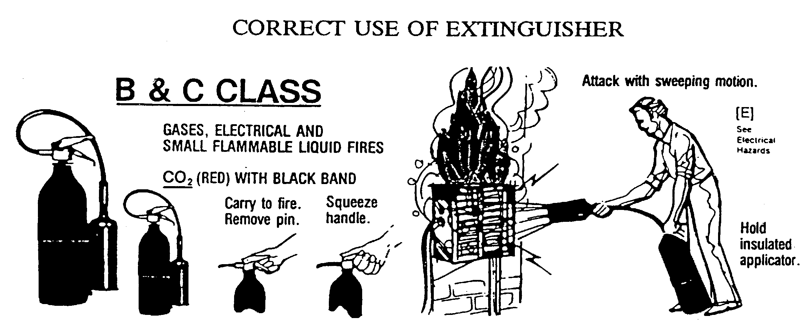
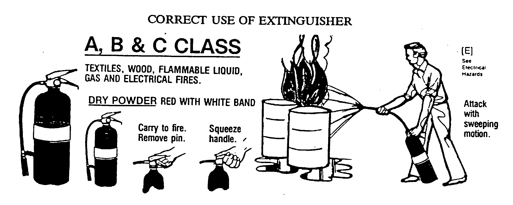
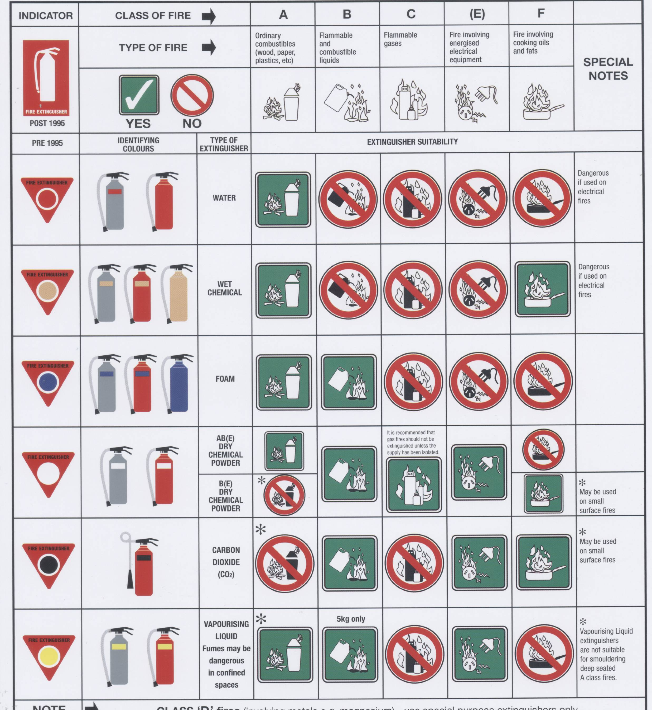

**MODULE 10.**

*************
Fire Fighting
*************

**Aim:**

To ensure crew are aware of the dangers of fire in the ship and
facilities and equipment on board to fight a fire.

**Overview:**

This module does not cover all aspects of fire fighting. However it
deals with those aspects relevant to the ship.

The following points will be covered in association with practical
application:

-  Fire prevention.

-  Basic principle of fire.

-  Equipment in the ship.

-  Crew response to a fire emergency.

-  Basic fire fighting strategies.

-  Fire extinguishers.

-  Hose reels.

-  Fire patrol.

-  Guide for Fire Party leader.

-  Fire incident procedures.

-  Chart of Fire Extinguishers.

**Assessment:**

Oral and practical examination by Mate/ Watchleader, who will, when
satisfied, sign off the appropriate tasks in crew member’s ‘Diary of
Service and Experience Log’ book.

**Outcome:**

Crew to understand the dangers associated with a fire on board and
become competent in alarm procedures and handling fire fighting
equipment in the ship.

Fire Prevention
===============

It is the responsibility of all crew to practice fire prevention by
being vigilant to any situation that could lead to fire.

Action should be taken immediately to correct any hazardous situation.

Prevention is better than cure, so;

- Smoking is only permissible near the foremast.

- Keep the ship tidy by disposing of or stow rags and rubbish safely.

- Report any damage to Fire Fighting equipment to the Officer of the
  Watch.

Basic Principles Of Fire – In Brief
===================================

Fire is a chemical reaction. The most common chemical reaction is the
one between oxygen in the air and flammable vapours released from the
fuel.

The components necessary for a fire to burn, or continue to burn, are
illustrated in the fire triangle below.

|fire-triangle|

Combustion is a process of oxidation i.e. a combination of oxygen and a
substance.

Substances oxidise at different temperatures. When a substance is
oxidising at such a rate that heat and light are being released, it is
described as being ‘alight’ or ‘on fire’.

For a fire to be sustained a chain reaction between the fuel and oxygen
is promoted by the heat.

Fire, once started, can be transferred or travel by;

- Radiation

- Convection

- Conduction

Therefore to fight a fire in the ship appropriate methods and equipment
are used to break, at least, one leg of the triangle and reduce the
ability of the fire to spread.

Some examples that may be used:-

Oxygen - restrict flow of air to the fire by smothering i.e. fire
blanket, extinguisher, seal a compartment.

Heat - if safe to do so, cool with water.

Fuel - turn off or, if possible, remove the source.

Radiation - shield with water fog or non flammable screen.

Convection - ventilate the space to allow flammable gas to escape
safely.

Conduction - cool down surfaces.

Equipment In The Ship
=====================

Fire Fighting appliances fitted in James Craig are shown on the Fire &
Emergency Plan displayed on the port side in the ‘tween deck and near
the Engine Room entrance.

The ship is equipped with detection equipment, extinguisher flood system
in engine room, hose reels with fire pumps, extinguishers, fire
blankets, fire buckets.

The control panel for smoke and thermal detection is located near the
engine room access door.

**All** crew are required to be familiar with the location and type of
portable extinguishers carried in the vessel and their use.

Crew will also make themselves familiar with the location and operation
of hose reels and hydrants.

Fire Alarm can be initiated verbally, by smoke detector alarm, fire
alarm, public address system or any means available to attract
attention.

Action In The Event Of A Fire
===============================

    ACTION TO BE CONSIDERED ON DISCOVERING A FIRE.

     **“Rescue”** any person/s in immediate danger.

     *Only if safe to do so.*

     **“Alarm”** Raise alarm and follow the ship’s emergency procedure.

     **“Contain”** Close doors and hatches to contain fire.

     **“Extinguish”** Attempt to extinguish the fire *only if you are
     trained and it is safe to do so.*

If any member of the ship’s company discovers smoke or a fire, they must
immediately raise the Alarm shouting loudly the words "Fire, Fire, Fire"
as they make their way quickly to the Quarter Deck to report to the
Officer Of the Watch. It is essential that the alarm be given first
before any attempt is made to extinguish the fire.

It is not a requirement that flames be seen before raising the alarm,
sighting or smelling smoke are also signs of fire and should be so
regarded. It is preferable that the alarm be given and subsequently
found to be a False Alarm than that timidity or over caution, preventing
an early response to a developing fire.

If possible, the space in which the fire is situated should be isolated
after first making sure that it is unoccupied.

Crew discovering a fire are permitted to make a single attempt to
extinguish a small fire with an appropriate portable extinguisher only
after somebody has gone to raise the alarm, and only if they are
confident of doing so and do not endanger themselves. In the case of a
large fire, the crewmember discovering the fire should not attempt to
extinguish it. Passengers are not permitted to attempt to extinguish any
fire.

The closing of special doors e.g. Engine room doors, in the event of
fire are set out in respect to each compartment.

Crew Response To Fire Emergency
===============================

Fire Party crew, as shown on crew cards, will immediately report to the
fire assembly point.

Crew who have not been designated to Fire Party duties on their Crew
Cards, will immediately report to their emergency station.

Basic Fire Fighting Strategies
==============================

First attack Strategy
---------------------

For example, at a very small fire in the ship a first-attack strategy
may be used.

This might typically involve simultaneously protecting people and
property by putting out the fire with a fire extinguisher, fire blanket
or fire bucket. It simply means that the fire can be extinguished
quickly and easily with minimum equipment.

Such a strategy can prevent a fire developing to a point where "heavier"
fire fighting equipment, such as hose lines, would be required.

***A first-attack strategy may be used by crew who are trained to use
fire extinguishers.***

Second attack Strategies.
-------------------------

These attacks should only be undertaken at the direction of an officer
or fire party leader due to complexities of the ship environment. i.e.
Confined spaces, ship stability etc.

Fire Extinguishers
==================

Training and practice are the only effective ways to become familiar
with using extinguishers. Some general guidelines are given below.

**NOTE:** When an extinguisher is empty, lay it on its side.

Remember Fire Buckets at the break of the quarter deck are there to be
used.

Water Extinguishers (Red Colour)
--------------------------------

Water extinguishers (Red Colour) should be used only for Class A fires
(Wood, paper & plastic). The range of the discharge is about 6 metres
and it should be aimed at the base of the burning material. The
extinguisher will be empty after about 1 minute of discharge.

Hose reels in the ship can be used to apply water in a similar way to
water extinguishers. They can only be used at the direction of an
officer.

Water can conduct electricity and water extinguishers or hose-reels
should not be used on fires involving electricity.

Water from an extinguisher or hose reel should not used on burning
flammable liquids as it will make the fire spread and become more
intense.

|image1|

Carbon Dioxide (C0:sub:`2`) Extinguishers (Black Band)
------------------------------------------------------

Mainly for use on fires involving electricity and small Class B
(Flammable and combustible liquids) fires. Range of discharge is only
about 1 to 2 metres. It should be applied with a sweeping motion, and
the duration of discharge is similar to that of extinguishing powder.

C0\ :sub:`2` extinguished fires are also subject to reignition if not
completely put out.

C0\ :sub:`2` makes a loud roaring noise and is intensely cold when
discharged.

|image2|

Powder Extinguishers (White Band)
---------------------------------

Mainly for use on Class B (Flammable and combustible liquids) fires, but
can be used on some other types, including fires involving electricity.
Range of discharge is about 5 to 7 metres, with a typical duration of
about 8 to 30 seconds, depending on the size of the unit.

The powder stream should be applied in a sweeping motion across the
flames. Note that the powder has little cooling effect, and reignition
may occur if the fire is not completely put out, or a hot spot or spark
is present.

Though a powerful fire fighting agent, extinguishing powder does leave a
messy powder residue, which, may damage sensitive equipment.

|image3|

Hose Lines
==========

The ship is equipped with 6 hose lines which are fed from two pump
systems.

Pump Systems
------------

Two pumping systems are on board.

1. In the engine room there are two electric pumps which can be used for
   multiple purposes.

  - Bilge pumps

  - Fire pumps

  The port pump is set up for fire and the starboard pump as a bilge pump.

2. A stand alone diesel engine pump is located in the lower hold,
   forward on the starboard side. This pump can be used for fire fighting
   or as a bilge pump.

Pumps are switched on by an engineer, officer or watchleader.

When using a fire hose to fight a fire on board, it must be remembered
that provision must be made to pump excess water overboard. Not to do so
could lead to ship instability due to free fluid movement.

Module 16, pages 17 to 28 contains information on Engine Room Fire and
General Service Pumps and Emergency Fire and Bilge Pump.

Hoses
-----

Location of hose lines are shown on the Ship’s Fire and Emergency Plan.

All the hoses and fittings are interchangeable.

The hoses are stowed in swing out racks near valve outlets, refer
photograph below.

|image4|

Deploy by holding the two ends and bowling the coil down the deck, away
from the fire.

To stow;

- lay hose out on the deck double with the ends off set by approximately
  one metre.

- the short end on top.

- roll the hose up tightly from the folded end.

- when completed both ends should be together.

- replace in rack.

Fire Party
==========

The Fire Party is made up of a Leader and 4 crew, under the direction of
an Officer.

Duties for each party member are shown on the member’s crew card.

Assembly point is the entrance to the crew deck house. Equipment is in
bags under the bottom starboard bunk near the door.

Fire Part radio is kept in the deckhouse. It is to be carried by the
patrol party when doing their rounds. This radio also is the only radio
which has a channel to the dockside security for guides and weekend
maintenance.

In addition to being on stand by, each hour the Leader of the party is
to organise a patrol of all decks of the ship.

The patrol will look out for;

- fire hazards.

- potential flood situations.

- anything that may affect the security of the ship or passengers /crew.

- check refrigeration is on.

- report any anomalies to the Officer of the Watch.

- record the patrol in the log.

Members of the fire party DO NOT CLIMB.

Guide For Fire Party Leader
===========================

- Establish fire party meeting point.

- Brief fire party and check that they know their respective roles.

- Check all equipment;

    Protective clothing.

    Torch

    Hose reels

    Fire extinguishers

    Fire buckets

    Radio

- Walk the ship each hour, main deck, ‘tween deck, hold and all closed
  compartments i.e. engine room, etc. Start patrol at chart room by
  checking the log for possible hazards etc noted by previous patrol.

- Fire party/patrol radio lives in the deckhouse. Patrol collects the
  radio at commencement of patrol and returns it to the deckhouse after
  completing patrol. This enables the patrol to immediately report any
  problems they find to the Officer of the Watch.

- Look out for potential hazards and fix/report.

- Fire extinguishers and hose reels are not obstructed.

- Fire station clear.

- When in the hold - check for flooding

- check ballast blocks for movement

- Fire doors and escape hatches are not obstructed.

- “Exit” lights are lit and not obscured.

- Note completion of the patrol in the log in the chart room.

- Report to officer of the watch when patrol has been completed.

- Return Radio to its holder in the deck house.

Fire Incident Procedures
========================

In the event of a fire, the following **immediate actions** are to be
carried out:

**Person Discovering the Fire**

If possible, attack the fire with an appropriate extinguisher

Evacuate the compartment, shutting the door/hatch

Raise the alarm.

Report the fire to the OOW.

**Officer of the Watch**

Sound the General Alarm and broadcast:

*Emergency Stations, Emergency Stations, Emergency Stations,*

*Fire, Fire, Fire*

*Fire in the...*

*Shut down all ventilation*.’

The OOW is to manoeuvre the ship as required to reduce the wind over
the deck and/or the ship’s motion.

Incident Control
----------------

Second Mate 
  Go to the scene of the fire and assume the role of
  Incident Coordinator. Establish communications with the quarter
  deck.

Chief Engineer 
  Start the fire and bilge pumps
  
  Start the second generator
  
  Go to the scene of the fire and make an engineering assessment.

  Isolate power and shut off fuel as directed by the Incident
  Controller.

Crew I/C of Fire Party 
  muster the fire party.
  
  Ensure personnel are correctly dressed and the appropriate fire
  fighting appliances are present.

  Report to the Incident Controller.

Fire Party members 
  Get dressed in protective clothing.

  Go to the location indicated in the broadcast.

  Fight the fire as directed by the Crew I/C of the Fire Party.

Medical & Stretcher Party
  Muster at the deckhouse.

  Assemble equipment.

  Await instructions.

Other Positions
---------------

First Mate Take over the Watch on the Quarter Deck.

Third Mate Establish the ship’s position and standby to transmit a
Pan Pan or May Day on VHF Ch 16 or HF 2182

Second Engineer Take over the engine throttles on the quarterdeck.

Chief Steward Muster the passengers in accordance with the manifest
and report the numbers to the First Mate.

Remaining Crew Muster in watches at Muster Stations.

Considerations in Fighting the Fire
-----------------------------------

In fighting the fire, the Incident Controller is to consider carrying
out the following as soon as practical:

-  Search the affected compartment for possible personnel;

-  Isolate the compartment electrically;

-  Ensure ventilation is off and the compartment shut down to the
   maximum extent possible.

-  If internal combustion machinery is involved or the fire is in a
   machinery space, shut off fuel

-  Boundary cooling

-  In the event of an Engine Room fire, consider drenching the space (to
   be approved only by the Master).

Considerations when the Fire has been Extinguished
--------------------------------------------------

-  Assigning a fire sentry

-  Clearance of toxic fumes

-  Restoration of ship’s services

-  Documentation of the incident

-  Debriefing of the ship’s company

Fire Extinguisher Selection
===========================

**A labeling system** uses standard pictorial symbols which show the
class
or classes of fire for which the extinguisher is suited. The symbols
identify the type of fire the extinguisher can be used for.

**Note:** A red slash stroked through any of the fire classification
symbols means it is unsafe to use that extinguisher on that class of fire. For example, a
water-filled extinguisher would show the symbols for Class B and C
fires slashed through as water should never be used to extinguish a
flammable liquid or an electrical fire.

If a symbol is not shown on the extinguisher's label, it simply means
the extinguisher was not tested for that class of fire.

Fire Extinguisher Selection Chart
=================================

|image5|

.. |fire-triangle| image:: ./media/Fire_triangle.*

.. |image4| image:: ./media/image5.wmf
   :width: 1.44444in
   :height: 2.12361in

